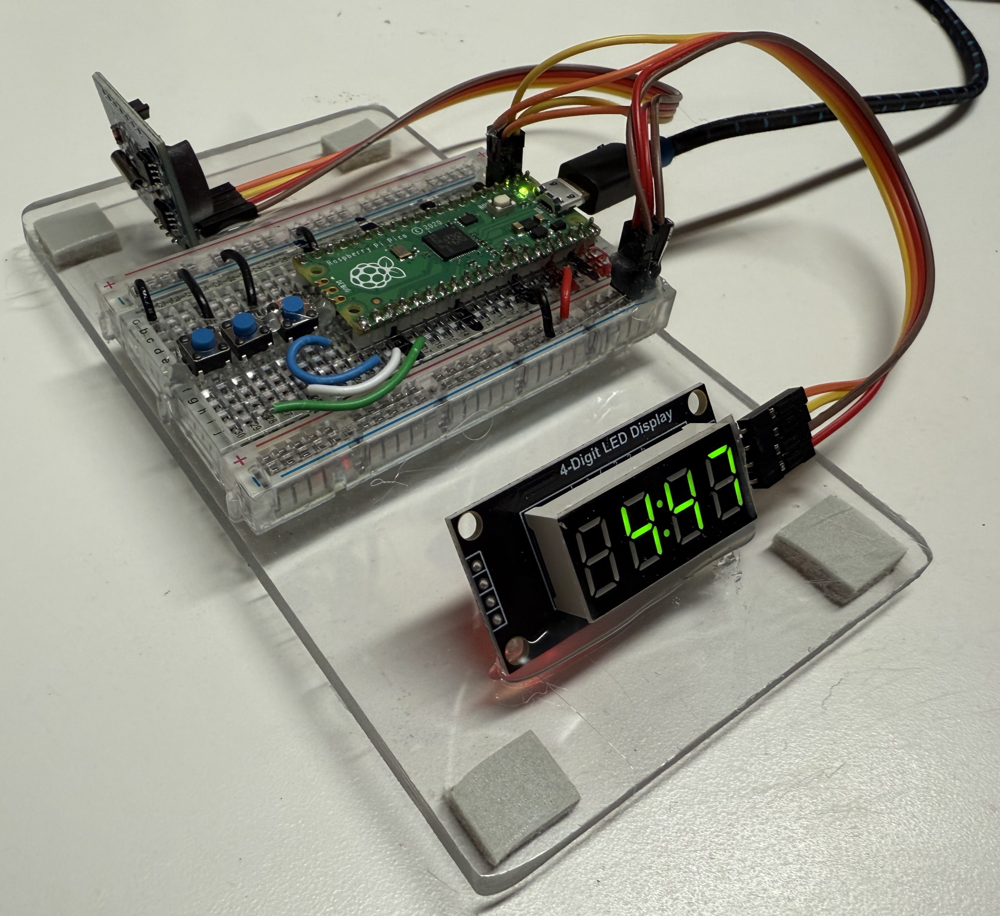
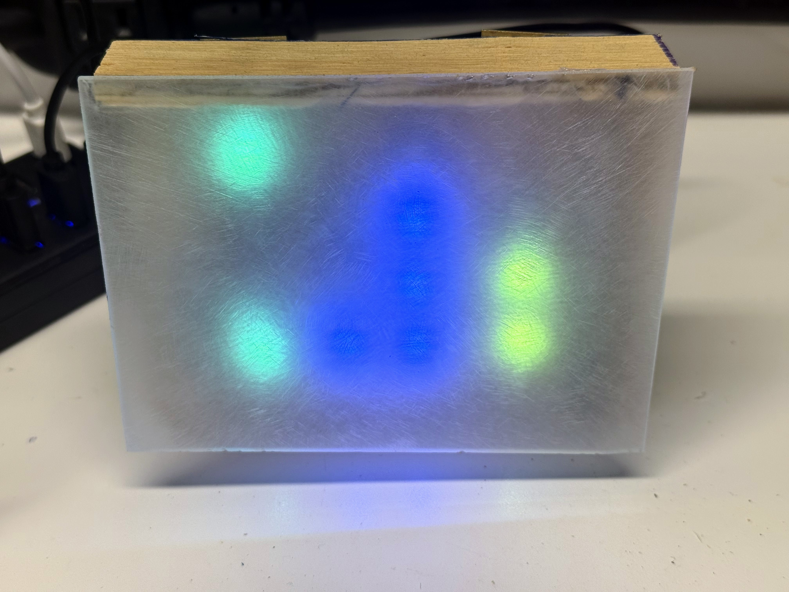
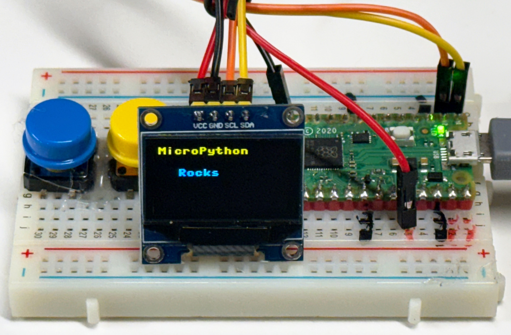
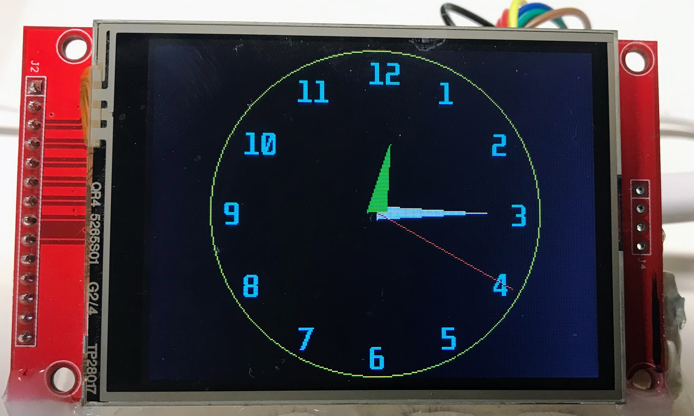

# Gallery of Clock and Watch Projects

- [TM1637 LED Clock](./tm1637/index.md) 
- [NeoPixel Binary Clock](./neopixel/binary-clock/index.md) 
- [NeoPixel Seven Segment Clock](./neopixel/seven-segment-clock/index.md) 
- [NeoPixel Fibonacci-clock](./neopixel/fibonacci-clock/index.md)
- Shift Register Clocks
- [OLED SSD1306 I2C Clock](./ssd1306-i2c/index.md) 
- [OLED SH1106 Clock](./sh1106/index.md) 
- ST77XX Color TFT Clock
- [Large SSD1306 OLED Clock](./oled-large/index.md) 
- [Stopwatch](./stopwatch/index.md) 
- Alarm Clock
- [Wireless Clock](./oled-wireless/index.md) 
- [ILI9341](./ili9341/index.md) 
- [GC9a01 Smartwatch Display](./gc9a01/index.md) 
- [EPaper Display Clock](./e-paper/index.md)

