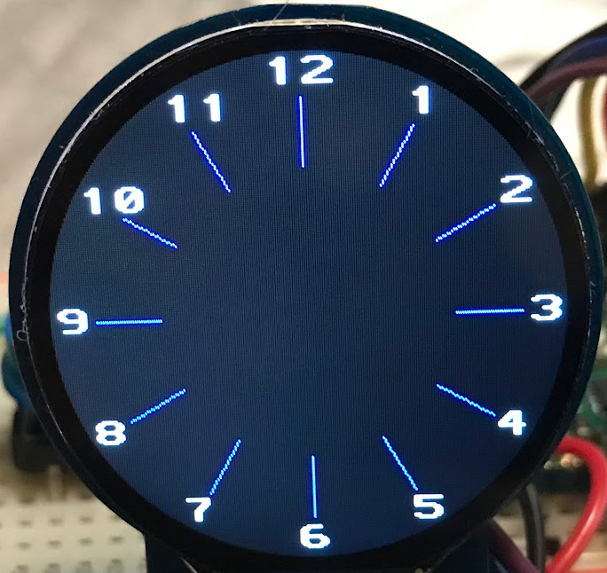

# Draw Clock Dial Digits

This program builds on the previous progam that draws the ticks.
It also draws a ditit at the end of each tick.


We use the same math we used to draw a single hand.  However, in
this example we just need to iterate through a range of 0 to 12.

We have to remember to load our 16x32 fonts.  Although this is a bit
large for most watch faces, they are easy to read.

Here is the line we added:
```py
import vga1_bold_16x32 as font
```

Note that there are other sizes we can use.  A list of the other fonts is here:

[GitHub Site for Russ Hughes for GC9a01 bitmap fonts](https://github.com/russhughes/gc9a01_mpy/tree/main/fonts/bitmap)

These fonts include the following sizes:

1. 8x8
3. 8x16
1. 16x16
2. 16x32

Here is the appropriate line for the normal 16x16:

```py
import vga1_16x16 as font
```

```py
if i == 0:
    num_str = "12"
else:
    num_str = str(i)
tft.text(font, num_str, CENTER+x3-8, CENTER+y3-16, WHITE)
```
Note because the fonts are 16 wide and 32 high we move 8 to the left and 16 up.

## Full Program

```py
from machine import Pin, SPI
from utime import sleep, localtime
import math
import gc9a01
import vga1_bold_16x32 as font


# this uses the standard Dupont ribbon cable spanning rows 4-9 on our breadboard
SCK_PIN = 2 # row 4
SDA_PIN = 3
DC_PIN = 4
CS_PIN = 5
# GND is row 8
RST_PIN = 6

# define the SPI intrface
spi = SPI(0, baudrate=60000000, sck=Pin(SCK_PIN), mosi=Pin(SDA_PIN))
tft = gc9a01.GC9A01(spi, 240, 240, reset=Pin(RST_PIN, Pin.OUT),
    cs=Pin(CS_PIN, Pin.OUT), dc=Pin(DC_PIN, Pin.OUT), rotation=0
)
tft.init()

CENTER = 120
TICK_START = 50
TICK_END = 80
NUM_POS = 100

# our counter will range from 0 to 59
# A full circle is 2*Pi radians
TWO_PI = 3.145175*2
counter = 0
WHITE = gc9a01.color565(255, 255, 255)
BLACK = gc9a01.color565(0, 0, 0)
BLUE = gc9a01.color565(0, 0, 255)
tft.fill(BLACK)
for i in range(0,12):
    radians = (i/12)*TWO_PI
    x1 = int(math.sin(radians)*TICK_START)
    y1 = -int(math.cos(radians)*TICK_START)
    x2 = int(math.sin(radians)*TICK_END)
    y2 = -int(math.cos(radians)*TICK_END)
    x3 = int(math.sin(radians)*NUM_POS)
    y3 = -int(math.cos(radians)*NUM_POS)
    print(i, radians, x1, y1, x2, y2)  
    tft.line(CENTER+x1, CENTER+y1, CENTER+x2, CENTER+y2, BLUE)
    if i == 0:
        num_str = "12"
    else:
        num_str = str(i)
    tft.text(font, num_str, CENTER+x3-8, CENTER+y3-16, WHITE)
```

If you use the 16x16 font the offset in the last line are:

```py
    if i == 0:
        num_str = "12"
        xOffest = 16
    else:
        num_str = str(i)
        xOffest = 8
    tft.text(font, num_str, CENTER+x3-xOffest, CENTER+y3-8, WHITE)
```

The exception is for the "12" at the top of the dial.  The "12"
needed to be exactly centered above the top tick mark.



## Full Code for 16x16 Clock Face Digits

```py
from machine import Pin, SPI
from utime import sleep, localtime
import math
import gc9a01
import vga1_16x16 as font


# this uses the standard Dupont ribbon cable spanning rows 4-9 on our breadboard
SCK_PIN = 2 # row 4
SDA_PIN = 3
DC_PIN = 4
CS_PIN = 5
# GND is row 8
RST_PIN = 6

# define the SPI intrface
spi = SPI(0, baudrate=60000000, sck=Pin(SCK_PIN), mosi=Pin(SDA_PIN))
tft = gc9a01.GC9A01(spi, 240, 240, reset=Pin(RST_PIN, Pin.OUT),
    cs=Pin(CS_PIN, Pin.OUT), dc=Pin(DC_PIN, Pin.OUT), rotation=0
)
tft.init()

CENTER = 120
TICK_START = 70
TICK_END = 100
NUM_POS = 111

# our counter will range from 0 to 59
# A full circle is 2*Pi radians
TWO_PI = 3.145175*2
counter = 0
WHITE = gc9a01.color565(255, 255, 255)
BLACK = gc9a01.color565(0, 0, 0)
BLUE = gc9a01.color565(0, 0, 255)
tft.fill(BLACK)
for i in range(0,12):
    radians = (i/12)*TWO_PI
    x1 = int(math.sin(radians)*TICK_START)
    y1 = -int(math.cos(radians)*TICK_START)
    x2 = int(math.sin(radians)*TICK_END)
    y2 = -int(math.cos(radians)*TICK_END)
    x3 = int(math.sin(radians)*NUM_POS)
    y3 = -int(math.cos(radians)*NUM_POS)
    print(i, radians, x1, y1, x2, y2)  
    tft.line(CENTER+x1, CENTER+y1, CENTER+x2, CENTER+y2, BLUE)
    if i == 0:
        num_str = "12"
        xOffest = 16
    else:
        num_str = str(i)
        xOffest = 8
    tft.text(font, num_str, CENTER+x3-xOffest, CENTER+y3-8, WHITE)
```