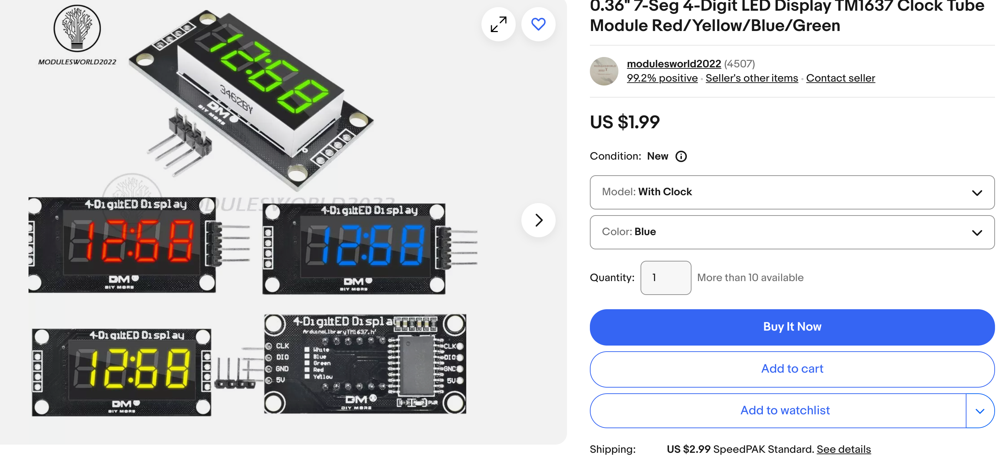

# LED Display Clock



We can use the TM1637 4-Digit LED Display Module which can be purchased
on e-Bay for a few dollars.  This means that your clock will cost under $10 total.

[Sample Listing on EBay](https://www.ebay.com/itm/1452339091850)


## Hookup Instructions

We can hook this up to  the Raspberry Pi.

|Name|Pin||
|5 Volts|VBUS or VSYS|
|GND|Any GND Pin|
|CLK|Pins 4| 
|Data|Pin 5 |

## MicroPython Driver

[Mike Causer GitHub Example](https://github.com/mcauser/micropython-tm1637)

## Sample Code

## Python Imports

```python
import tm1637
from machine import Pin
from utime import sleep
tm = tm1637.TM1637(clk=Pin(0), dio=Pin(1))
```

## Test Program
```python
import tm1637
from machine import Pin
from utime import sleep
tm = tm1637.TM1637(clk=Pin(0), dio=Pin(1))

while True:
    # all LEDS on "88:88"
    tm.write([127, 255, 127, 127])
    sleep(1)

    # all LEDS off
    tm.write([0, 0, 0, 0])
    sleep(1)

    # show "0123"
    tm.write([63, 6, 91, 79])
    sleep(1)

    # show "COOL"
    tm.write([0b00111001, 0b00111111, 0b00111111, 0b00111000])
    sleep(1)

    # show "HELP"
    tm.show('help')
    sleep(1)

    # display "dEAd", "bEEF"
    tm.hex(0xdead)
    sleep(1)

    tm.hex(0xbeef)
    sleep(1)

    # show "12:59"
    tm.numbers(12, 59)
    sleep(1)

    # show "-123"
    tm.number(-123)
    sleep(1)

    # show temperature '24*C'
    tm.temperature(24)
    sleep(1)
```

Next, will will use the ```localtime()``` function to build a simple
clock.

[Simple Clock](./clock-simple.md)


## References

* [Mike Causer TM1637 Driver GitHub Repo](https://github.com/mcauser/micropython-tm1637)
* [YouTube Video by NerdCave](https://youtu.be/D68XtvZlk00?si=97WdbeKOTFt6Rt6e)