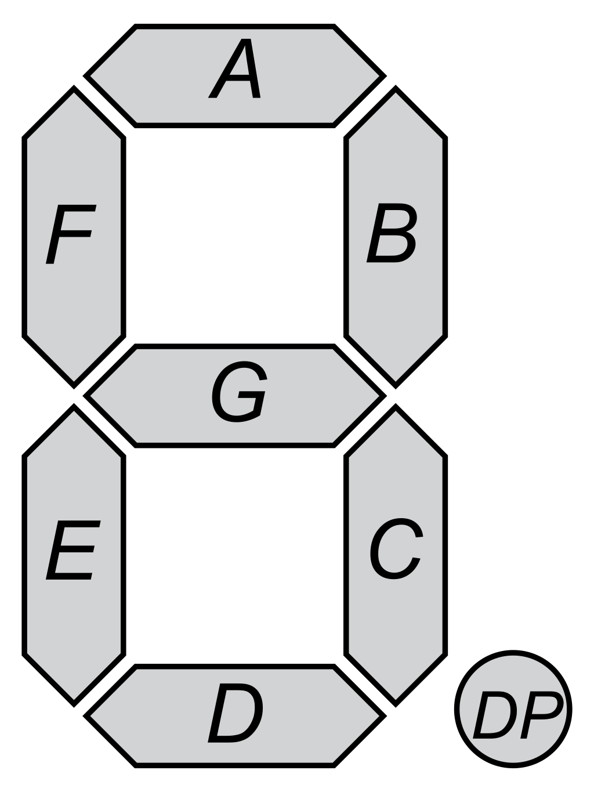

# Seven Segment Clock

We can create a large, bright clock visible in a large classroom by lighting up
selective pixels of an LED strip and arranging the pixels in the shape
of seven segment displays.  We can use three pixels per segment.



* We can use three pixels per segment.
* 21 pixels per digit
* 63 pixels + 6 for the "1" + two for the colon = 70 pixels


[eBay 50 for $12](https://www.ebay.com/itm/165045487983)

Drawing Digits

[Lessons](../../lessons/07-drawing-digits.md)

We can create an array of the segments like this:

```py
segmentMapping = [
  #a, b, c, d, e, f, g
  [1, 1, 1, 1, 1, 1, 0], # 0
  [0, 1, 1, 0, 0, 0, 0], # 1
  [1, 1, 0, 1, 1, 0, 1], # 2
  [1, 1, 1, 1, 0, 0, 1], # 3
  [0, 1, 1, 0, 0, 1, 1], # 4
  [1, 0, 1, 1, 0, 1, 1], # 5
  [1, 0, 1, 1, 1, 1, 1], # 6
  [1, 1, 1, 0, 0, 0, 0], # 7
  [1, 1, 1, 1, 1, 1, 1], # 8
  [1, 1, 1, 1, 0, 1, 1]  # 9
];

```

## Digit Pixel Map

TBD

* a: n, n+1, n+2
* b: n+3, n+4, n+5

```py
def set_pixels(digit, value, color):
    # look up start pixel for digit
    # for value turn on pixels
    n = startVals[digit]

    segmentOn = segmentMapping[value];
    for i in range(0, 9):
        if (segmentOn[i]):
            o = i*3 // offset
            strip(n+o) = color
            strip(n+o+1) = color
            strip(n+o+2) = color
```
```

[7-Segment Display Demo with P5.js](https://www.coderdojotc.org/chatgpt-for-teachers/demos/p5/7-segment-display/)

[Moving Rainbow Arduino Sign](https://www.instructables.com/Moving-Rainbow-Arduino-Sign/)

