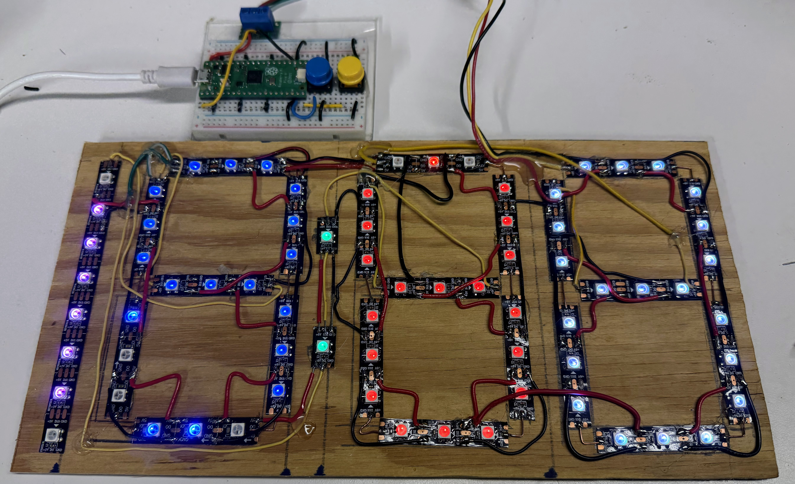
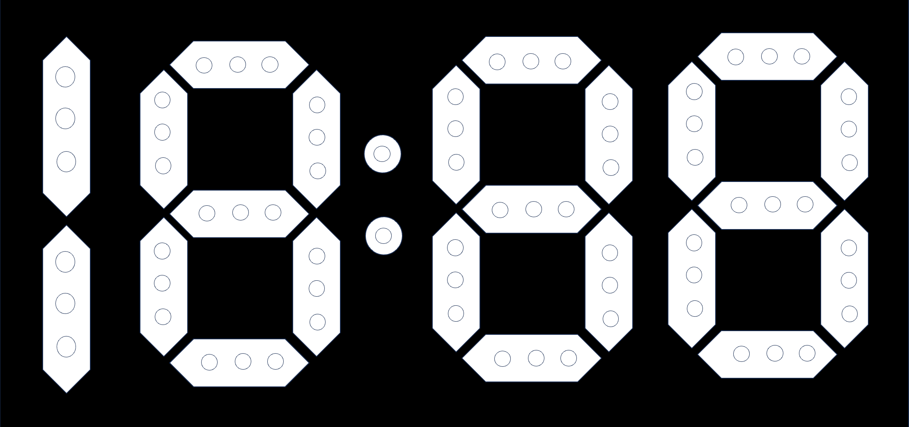

# Seven Segment Clock



We can create a large, bright clock visible in a large classroom by lighting up
selective pixels of an LED strip and arranging the pixels in the shape
of seven segment displays.  We can use three pixels per segment.


* We can use three pixels per segment.
* 21 pixels per digit
* 63 pixels + 6 for the "1" + two for the colon = 70 pixels



[eBay 50 for $12](https://www.ebay.com/itm/165045487983)

Drawing Digits

[Lessons](../../lessons/07-drawing-digits.md)

We can create an array of the segments like this:

```py
segmentMapping = [
  #a, b, c, d, e, f, g
  [1, 1, 1, 1, 1, 1, 0], # 0
  [0, 1, 1, 0, 0, 0, 0], # 1
  [1, 1, 0, 1, 1, 0, 1], # 2
  [1, 1, 1, 1, 0, 0, 1], # 3
  [0, 1, 1, 0, 0, 1, 1], # 4
  [1, 0, 1, 1, 0, 1, 1], # 5
  [1, 0, 1, 1, 1, 1, 1], # 6
  [1, 1, 1, 0, 0, 0, 0], # 7
  [1, 1, 1, 1, 1, 1, 1], # 8
  [1, 1, 1, 1, 0, 1, 1]  # 9
]
```

## Digit Pixel Map

Assume that a digit starts at pixel n and
that each segment has three pixels.
To turn on the segments, here is the mapping:

* a: n, n+1, n+2
* b: n+3, n+4, n+5
* c: n+6, n+7, n+8
* d: n+9, n+10, n+11

```python
def set_pixels(digit, value, color):
    # look up start pixel for digit
    # for value turn on pixels
    n = startVals[digit]

    segmentOn = segmentMapping[value];
    for i in range(0, 9):
        if (segmentOn[i]):
            o = i*3 // offset
            strip(n+o) = color
            strip(n+o+1) = color
            strip(n+o+2) = color
```

## Clock Code

```python
from machine import Pin
from neopixel import NeoPixel
from utime import sleep, localtime

NUMBER_PIXELS = 74
strip = NeoPixel(Pin(0), NUMBER_PIXELS)

# Define segment patterns for digits 0-9
# Segments in order [a,b,c,d,e,f,g]:
# a: top (0,1,2)
# b: top right (3,4,5)
# c: bottom right (6,7,8)
# d: bottom (9,10,11)
# e: bottom left (12,13,14)
# f: upper left (15,16,17)
# g: middle (18,19,20)
DIGITS = {
    #    a,b,c,d,e,f,g
    0: [1,1,1,1,1,1,0],  # all but middle
    1: [0,1,1,0,0,0,0],  # right side only
    2: [1,1,0,1,1,0,1],  # all but bottom right and upper left
    3: [1,1,1,1,0,0,1],  # all but left side
    4: [0,1,1,0,0,1,1],  # both right, upper left, and middle
    5: [1,0,1,1,0,1,1],  # all but top right and bottom left
    6: [1,0,1,1,1,1,1],  # all but top right
    7: [1,1,1,0,0,0,0],  # top and both right segments
    8: [1,1,1,1,1,1,1],  # all segments
    9: [1,1,1,1,0,1,1]   # all but bottom left
}

# Color definitions (RGB)
ON_COLOR = (10, 10, 10)  # Dim white
OFF_COLOR = (0, 0, 0)    # Off

def set_segment_pixels(start_idx, segment_pattern):
    """Set three pixels for a segment based on pattern"""
    for i in range(3):
        strip[start_idx + i] = ON_COLOR if segment_pattern else OFF_COLOR

def display_digit(digit, start_pixel):
    """Display a single digit starting at the specified pixel"""
    if digit not in DIGITS:
        return
    
    pattern = DIGITS[digit]
    # Map the array positions to the physical segments in correct order
    segments = [
        start_pixel + 0,   # a: top (0,1,2)
        start_pixel + 3,   # b: top right (3,4,5)
        start_pixel + 6,   # c: bottom right (6,7,8)
        start_pixel + 9,   # d: bottom (9,10,11)
        start_pixel + 12,  # e: bottom left (12,13,14)
        start_pixel + 15,  # f: upper left (15,16,17)
        start_pixel + 18   # g: middle (18,19,20)
    ]
    
    # Set pixels for each segment based on pattern
    for segment_index, segment_on in enumerate(pattern):
        set_segment_pixels(segments[segment_index], segment_on)
    
    # Set pixels for each segment based on pattern
    for segment_index, segment_on in enumerate(pattern):
        set_segment_pixels(segments[segment_index], segment_on)

def set_colon(on=True):
    """Set colon pixels (42 and 43)"""
    color = ON_COLOR if on else OFF_COLOR
    strip[42] = color
    strip[43] = color

def display_time(hour, minute, colon_on):
    """Display time on the LED strip"""
    # Convert 24-hour to 12-hour format
    hour = hour if hour <= 12 else hour - 12
    if hour == 0:
        hour = 12
        
    # Set hours "1" digit if needed (pixels 65-73)
    if hour >= 10:
        for i in range(65, 74):
            strip[i] = ON_COLOR
    else:
        for i in range(65, 74):
            strip[i] = OFF_COLOR
    
    # Display ones digit of hours (pixels 44-64)
    display_digit(hour % 10, 44)
    
    # Display tens digit of minutes (pixels 21-41)
    display_digit(minute // 10, 21)
    
    # Display ones digit of minutes (pixels 0-20)
    display_digit(minute % 10, 0)
    
    # Set colon (pixels 42-43)
    set_colon(colon_on)
    
    strip.write()

def clear_display():
    """Turn off all pixels"""
    for i in range(NUMBER_PIXELS):
        strip[i] = OFF_COLOR
    strip.write()

# Main loop
colon_state = True
clear_display()

while True:
    current_time = localtime()
    hour = current_time[3]
    minute = current_time[4]
    if hour > 12:
        display_hour = hour - 12
    
    display_time(hour, minute, colon_state)
    colon_state = not colon_state
    print(f'{display_hour}:{minute}')
    sleep(1)
  ```

[7-Segment Display Demo with P5.js](https://www.coderdojotc.org/chatgpt-for-teachers/demos/p5/7-segment-display/)

[Moving Rainbow Arduino Sign](https://www.instructables.com/Moving-Rainbow-Arduino-Sign/)

