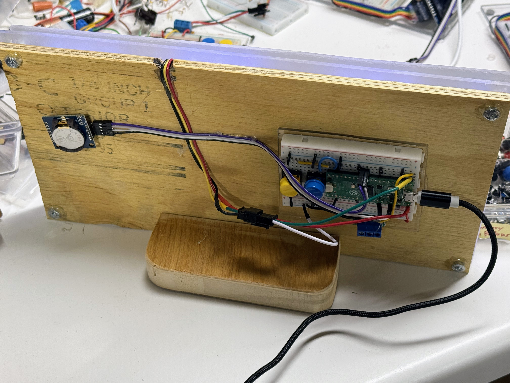

# Assembling Your Seven Segment NeoPixel Clock

## Time Estimate

- 4 digits
- 7 segments per digit
- 6 solder connections per segment
- two colons - four solder connections each

Total = 4*7*6 + 8 = 168 + 8 = 174 solder connections

Per connection (average times):

- Measuring, stripping, and bending wires: 30 seconds
- Positioning and soldering: 30 seconds
- Checking and testing: 30 seconds

Total: 260 minutes or 4.3 hours

Total: 180

