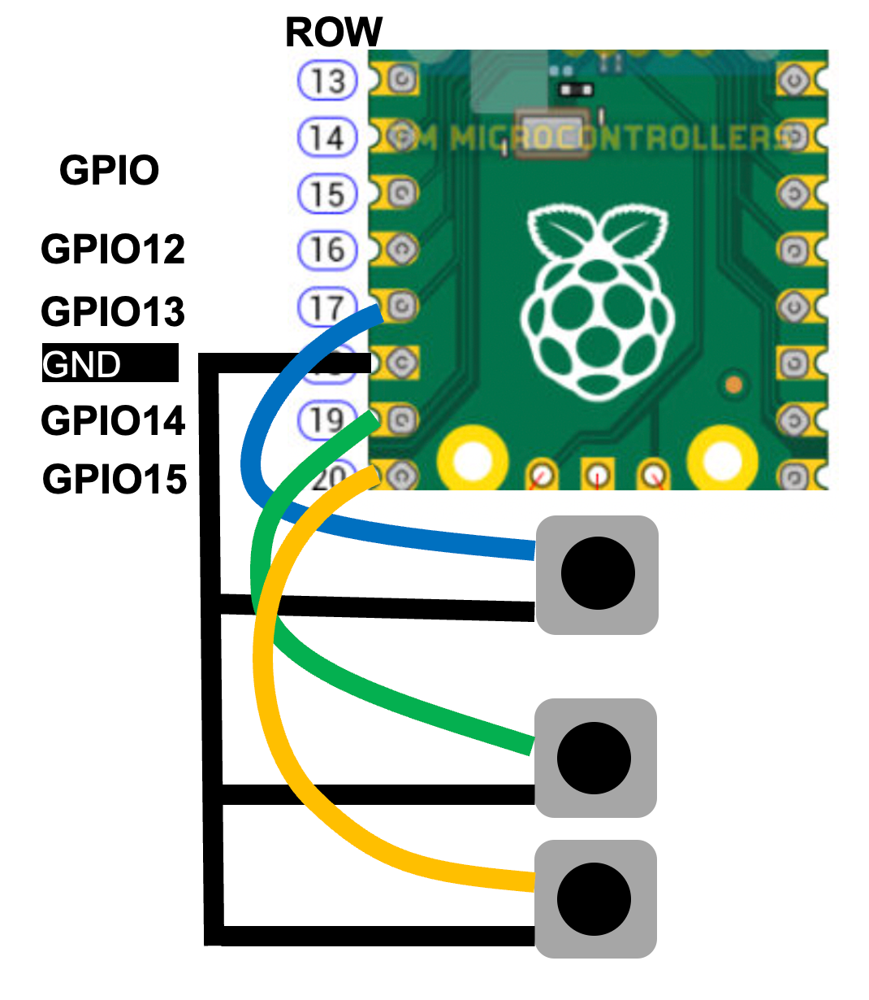

# Testing Your  Buttons



The diagram above shows three buttons below the Pico that
will connect GPIO pins 13, 14 and 15 to GND when they are pressed.
When they are not pressed the signals on 13, 14 and 15 must be
"pulled up" to 5 volts using the internal pull-up resistor within
the Pico.  We configure this when we setup the code.

## Sample Code

### Single Button Test

```python
from utime import sleep
from machine import Pin

# Sample Raspberry Pi Pico MicroPython button press example with a debounce delay value of 200ms in the interrupt handler

# Buttons
BUTTON_1_PIN = 13

button_1_pin = Pin(BUTTON_1_PIN, Pin.IN, Pin.PULL_UP)

# This function gets called every time the button is pressed.  The parameter "pin" is not used.
def button_1_pressed(pin):
    print('Button 1 pressed')

# now we register the button handler function using the irq setter method for this pin
button_1_pin.irq(trigger=Pin.IRQ_FALLING, handler = button_1_pressed)

while True:
    sleep(1)
```

### Three Button Test

```python
from utime import sleep
from machine import Pin

# Sample Raspberry Pi Pico MicroPython three button press example

# Button Pin GPIO Configuration
BUTTON_1_PIN = 13
BUTTON_2_PIN = 14
BUTTON_3_PIN = 15

# Create 3 button objects as inputs with pullup resistors
button_1_pin = Pin(BUTTON_1_PIN, Pin.IN, Pin.PULL_UP)
button_2_pin = Pin(BUTTON_2_PIN, Pin.IN, Pin.PULL_UP)
button_3_pin = Pin(BUTTON_3_PIN, Pin.IN, Pin.PULL_UP)

# These functions gets called every time a button is pressed.
def button_1_pressed(pin):
    print('Button 1 pressed')
def button_2_pressed(pin):
    print('Button 2 pressed')
def button_3_pressed(pin):
    print('Button 3 pressed')
    
# now we register the button handler functions using the irq setter method for each pin
button_1_pin.irq(trigger=Pin.IRQ_FALLING, handler = button_1_pressed)
button_2_pin.irq(trigger=Pin.IRQ_FALLING, handler = button_2_pressed)
button_3_pin.irq(trigger=Pin.IRQ_FALLING, handler = button_3_pressed)

# we don't do anything in the main loop but sleep
while True:
    sleep(1)

```