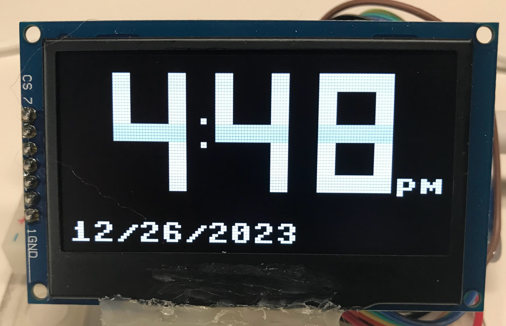

# OLED Digital Clock Display



In this section we will do a full walk through of a program that uses the real-time clock to get the time and displays the time using the four-digit drawing function we created.

Note that if you don't have your real-time clock connected or working you can still use this program to display the time using the ```localtime()``` function.

Change the following line:

From:
```python
now = rtc.