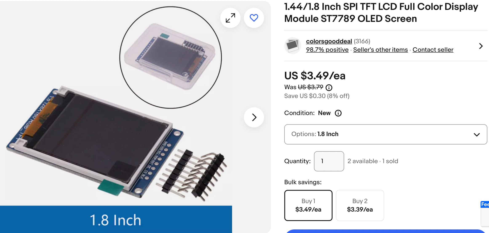

# Digital Clock Using the ST7735 LCD

## Overview

The ST7735 is a low-cost color LCD with a 160x120 screen resolution.  I found
the 1.8 inch version on eBay for about $3.50.  Because of the low-cost it makes an ideal starter clock display for clocks kits under $10.

The ST7735 uses a standard SPI 7-wire interface with one additional wire for powering the backlight of the display.  It works on 3.3 volts.

## Benefits of the ST7735 Clock Kit

### Color Display Capabilities

- The ST7735 offers full RGB color support using 16-bit color (RGB565 format)
- Allows for attractive color schemes like blue backgrounds with white digits shown in the code
- Can use different colors for different elements (e.g. TEXT_COLOR vs DIGIT_COLOR)
- The display can handle custom color combinations through the rgb_to_565() function

### Flexible Display Options

- Supports multiple rotation modes (0-3) through set_rotation()
- 160x128 resolution provides enough space for:
  - Large, readable digits
  - Date display
  - AM/PM indicator
  - Seconds display
  - Additional status information if needed

### Hardware Integration

- Uses standard SPI interface making it easy to connect to microcontrollers
- Simple pin configuration (Clock, MOSI, Reset, Data/Command, Chip Select)
- Works with 3.3V logic level, compatible with many modern microcontrollers
- Fast refresh rate with 8MHz SPI baudrate support

### Software Features

- Built-in font support for text rendering
- Efficient drawing primitives for shapes and lines
- Support for bitmap images
- Anti-flicker optimization in the clock code through selective updates
- Segment-based digit drawing for custom numerical displays

### Cost-Effective
- Low cost (around $3.50 USD) makes it ideal for budget-friendly clock projects
- Good balance of features vs price for hobbyist projects
- Accessible enough for beginner projects while having enough capabilities for advanced features

The code demonstrates these benefits through features like:

- Clean digit rendering using seven-segment style display
- Smooth updates with anti-flicker measures
- Multiple display elements (time, date, AM/PM) organized clearly on screen
- Efficient screen updates that only refresh changed portions