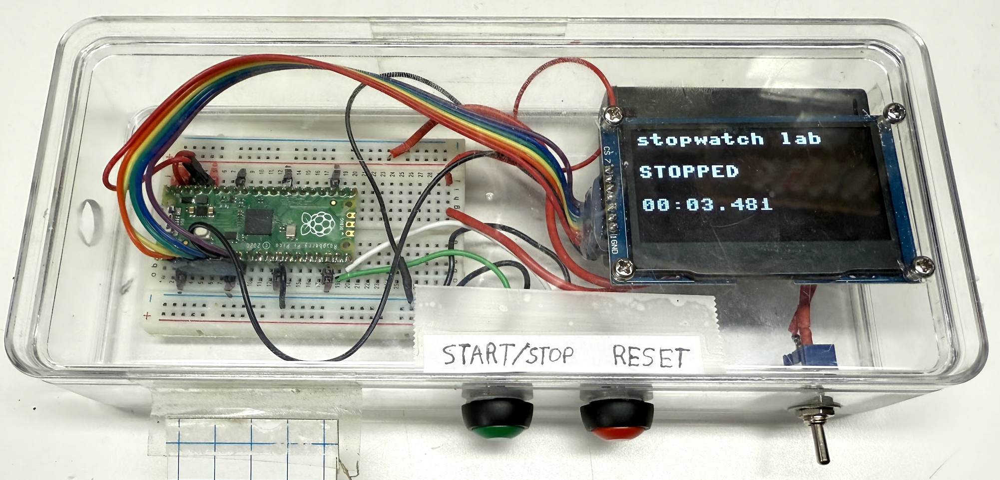

# Stopwatch



## Overview

Here is a two-button stopwatch that uses the OLED display.
The first button is called the **Start/Stop** button.  When you first press start it starts to add up the time since it was pressed.  Pressing it again will stop collecting time but still remember the total accumulated time while the stopwatch was running.

The second button is the **Reset** button.  When you press Reset the
total time accumulated will be reset back to 0.

## The MicroSimulation

<iframe src="../../sims/stopwatch/main.html" height="280px" width="370px"></iframe>

## Program Structure

Let me break down this stopwatch program in a way that's easy to understand!

Let's think of this like building a digital stopwatch step by step:

## STEP 1 - The Parts ("Hardware Setup")
- We're using a small computer called a Raspberry Pi Pico
- It has two buttons connected to it: one for Start/Stop and one for Reset
- There's a small screen (called an OLED display) that shows us the time
- The display connects to the Pico using special pins, like plugging in a cable

## STEP 2 - Setting Up Our Variables ("Global Variables")
- Think of these like creating storage boxes for important information
- We have boxes for:
  * Whether the stopwatch is running or stopped
  * When we started timing
  * How much time has passed in total
  * When we last pressed a button (to avoid accidental double-presses)

## STEP 3 - The Start/Stop Button Function
- When you press the Start/Stop button:
  * If the stopwatch was stopped → it starts running and remembers the start time
  * If it was running → it stops and saves how much time has passed
- It's like pressing the start/stop on a real stopwatch!

## STEP 4 - The Reset Button Function
- When you press Reset:
  * It stops the stopwatch
  * Sets all the saved time back to zero
  * Like clearing your stopwatch to start fresh

## STEP 5 - Making Time Look Nice ("format_time")
- This part takes the raw time (which is in milliseconds) and makes it look readable
- Instead of showing "12500 milliseconds", it shows "00:12.500" (12.5 seconds)
- It's like converting 60 minutes into 1 hour - just more precise!

## STEP 6 - Updating the Display
- This happens many times per second
- If the stopwatch is running:
  * It takes the current time and subtracts the start time
  * Adds any time saved from previous runs
  * Shows this on the screen
- If the stopwatch is stopped:
  * It just shows the saved time

## STEP 7 - The Main Program Loop
- This is like the heartbeat of the program
- Every 1/10th of a second:
  * It checks if any buttons were pressed
  * Updates the time on the display
  * Keeps everything running smoothly

Think of it like this: Imagine you're timing a race with a regular stopwatch. You:
1. Press start when the race begins (Start button)
2. Press stop when someone finishes (Stop button)
3. Can pause and restart for multiple racers (Start/Stop button again)
4. Clear it to zero for a new race (Reset button)

This program does all that, but digitally! The main difference is that it's much more precise - it can measure down to milliseconds (thousandths of a second), which would be impossible with a regular handheld stopwatch.

## Sample Code

```python
from mp_button import Button
from machine import Pin, SPI
import ssd1306
from utime import sleep, ticks_ms, ticks_diff

# lower right corner - button closes path to GND
# HARDWARE PIN CONFIGURATION
# LEDs
PICO_ONBOARD_LED_PIN = 25
# Button pins
STOPWATCH_START_STOP_PIN = 14
STOPWATCH_RESET_PIN = 15
# Display pins
DISPLAY_SCL_PIN = 2
DISPLAY_SDA_PIN = 3
DISPLAY_RES_PIN = 4
DISPLAY_DC_PIN = 5
DISPLAY_CS_PIN = 6

# configure the pins
start_stop_pin = Pin(STOPWATCH_START_STOP_PIN, Pin.IN, Pin.PULL_UP)
reset_pin = Pin(STOPWATCH_RESET_PIN, Pin.IN, Pin.PULL_UP)

led = machine.Pin(PICO_ONBOARD_LED_PIN, machine.Pin.OUT)

SCL=Pin(DISPLAY_SCL_PIN)
SDA=Pin(DISPLAY_SDA_PIN)
spi=SPI(0, sck=SCL, mosi=SDA)
RES = Pin(DISPLAY_RES_PIN)
DC = Pin(DISPLAY_DC_PIN)
CS = machine.Pin(DISPLAY_CS_PIN)
oled = ssd1306.SSD1306_SPI(128, 64, spi, DC, RES, CS)

# Global variables
STOPPED = const(0)
RUNNING = const(1)
stopwatch_state = STOPPED
stopwatch_starttime = 0
stopwatch_elapsed_time = 0  # Renamed from stopwatch_resume_time for clarity
last_start_stop_press = 0
last_reset_press = 0
DEBOUNCE_MS = 250

def start_stop_irq(pin):
    global last_start_stop_press, stopwatch_state, stopwatch_starttime, stopwatch_elapsed_time
    current_time = ticks_ms()
    if ticks_diff(current_time, last_start_stop_press) > DEBOUNCE_MS:
        last_start_stop_press = current_time
        
        if stopwatch_state == STOPPED:
            stopwatch_state = RUNNING
            stopwatch_starttime = ticks_ms()
        else:
            # Calculate the time elapsed since last start
            stopwatch_elapsed_time += ticks_diff(ticks_ms(), stopwatch_starttime)
            stopwatch_state = STOPPED

def reset_irq(pin):
    global last_reset_press, stopwatch_state, stopwatch_elapsed_time
    current_time = ticks_ms()
    if ticks_diff(current_time, last_reset_press) > DEBOUNCE_MS:
        last_reset_press = current_time
        stopwatch_state = STOPPED
        stopwatch_elapsed_time = 0

# Here are the Interupt handlers
start_stop_pin.irq(trigger=Pin.IRQ_RISING, handler=start_stop_irq)
reset_pin.irq(trigger=Pin.IRQ_FALLING, handler=reset_irq)


def format_time(milliseconds):
    """Convert milliseconds to formatted time string (MM:SS.mmm)"""
    seconds = milliseconds // 1000
    ms = milliseconds % 1000
    minutes = seconds // 60
    seconds = seconds % 60
    return f"{minutes:02d}:{seconds:02d}.{ms:03d}"

def update_screen(state, elapsed_time):
    global stopwatch_starttime
    oled.fill(0)
    oled.text("stopwatch lab", 0, 0, 1)
    state_text = "RUNNING" if state == RUNNING else "STOPPED"
    oled.text(state_text, 0, 20, 1)
    
    if state == RUNNING:
        current_time = elapsed_time + ticks_diff(ticks_ms(), stopwatch_starttime)
        oled.text(format_time(current_time), 0, 40, 1)
    else:
        oled.text(format_time(elapsed_time), 0, 40, 1)
    oled.show()

# Main loop
while True:
    update_screen(stopwatch_state, stopwatch_elapsed_time)
    sleep(0.1)
```