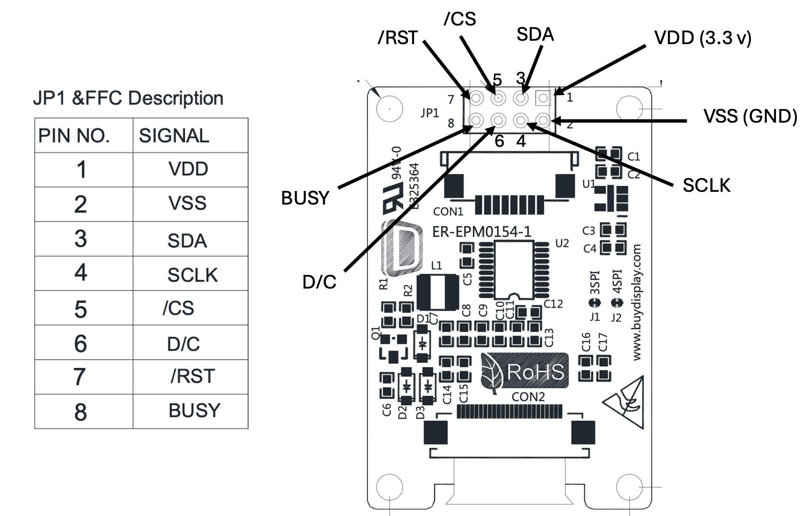

# Waveshare E-Paper Display

[Black 1.54 inch e-Paper/e-Ink Display Module 152x152 for Arduino,Raspberry Pi](https://www.ebay.com/itm/296569617099)

[1.54inch e-Paper Module (C)](https://www.waveshare.com/wiki/1.54inch_e-Paper_Module_(C))

[Data Sheet](https://www.buydisplay.com/download/manual/ER-EPM0154-1_Datasheet.pdf)

[BuyDisplay](https://www.buydisplay.com/1-54-inch-epaper-152x152-smallest-e-ink-display-panel-white-black)

# Description    

ER-EPM0154-1B is e-paper/e-ink display module that is 1.54 inch e-paper display panel attached with a breakout board, 152x152 resolution with white/black color, UC8151C controller,running both 3.3V and 5V power supply,super wide viewing angle,sunlight readable and easily controlled by MCU such as PIC, AVR, ARDUINO,ARM and Raspberry PI. One fantastic aspect of the ePaper display is the fact they don't need any power to keep the image on the screen. Just like a Kindle, you can read whatever is on your screen in daylight without any reflection.  It's optional for 3-wire or 4-wire serial interface. 

We prepared the library and examples for arduino due,mega 2560,uno,nano and for raspberry pi or raspberry pi zero.

## Waveshare MicroPython Driver

* [Waveshare MicroPython Driver](https://github.com/waveshareteam/e-Paper/tree/master/RaspberryPi_JetsonNano/python/lib/waveshare_epd)

The device I purchased is 152x152.


## Connections

|Pin|Name|Description|
|---|----|-----------|
|1|VDD|Power Supply (square)|
|2|VSS|Ground (round)|
|3|SDA|Serial Data Pin Input/Output (SPI)|
|4|SCL|Serial Clock Pin Input (SPI)|
|5|/CS|Chip Select Input Pin|
|6|D/C|Data /Command Control Pin|
|7|/RST|Reset Input. Low: Reset.|
|8|BUSY|Busy State Output Pin|



```python
from machine import Pin
import epd1in54b

mosi = Pin(0)
clk = Pin(1)
reset = Pin(2)
dc = Pin(3)
busy = Pin(4)
cs = Pin(5)

epd = epd1in54b.EPD(reset, dc, busy, cs, clk, mosi)
epd.init()

# initialize the frame buffer
fb_size = int(epd.width * epd.height / 8)
frame_black = bytearray(fb_size)

epd.clear_frame(frame_black, frame_red)

# For simplicity, the arguments are explicit numerical coordinates
epd.draw_rectangle(frame_black, 10, 60, 50, 110, epd1in54b.COLORED)
epd.draw_line(frame_black, 10, 60, 50, 110, epd1in54b.COLORED)
epd.draw_line(frame_black, 50, 60, 10, 110, epd1in54b.COLORED)
epd.draw_circle(frame_black, 120, 80, 30, epd1in54b.COLORED)

epd.display_frame(frame_black)
```