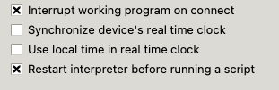

# Getting Local Time

## Lesson Overview

In this lesson, we will learn how to get the local date and time from the MicroPython runtime.  We will learn the components of the list of numbers returned by these functions.

MicroPython provides a very convenient function called ```localtime()``` that will get the time from the host computer that you connect to via your USB cable.  Your local computer has a clock and knows the time in the local timezone.  This information is sent to MicroPython runtime when the computer is connected to the USB cable.

!!! Note
    The ```gmtime()``` function returns the time in UTC (Coordinated Universal Time) time.  Use this if you want time stamps that are not dependent on time zone and daylight savings rules.  For example, log files should use this function.

## Sample Code

```py
import time

print(time.localtime())
```

## Result

Local time returns a read-only tuple:

```
(2023, 2, 28, 18, 54, 7, 1, 59)
```

## Format of the Localtime

The format is a "8-tuple" of integers in the format (year, month, mday, hour, minute, second, weekday, yearday)

Most of the values are pretty intuitive to figure out.  There are a few notes.

1. Hour is the hour in 24-hour format.  If we want to display the
hour in 12-hour format we will need to do some formatting.
1. Weekday is a numeric code that runs from 0 for Monday to 6 for Sunday.
2. Yearday is the day of the year.  January 1st is the fist day of the year so it is a 1.

## Printing Formatted Dates

### Sample Code

```py
import time

now = time.localtime()
label = ('year', 'month', 'mday', 'hour', 'minute', 'second', 'weekday', 'yearday')
for i in range(8):
    print(label[i], ':', now[i])

print()
print("Date: {}/{}/{}".format(now[1], now[2], now[0]))
print("Time: {}:{}".format(now[3], now[4]))
```

### Results

```
year : 2023
month : 2
mday : 28
hour : 19
minute : 20
second : 26
weekday : 1
yearday : 59

Date: 2/28/2023
Time: 19:20
```

## Label Formatting

We can also add labels to make the date and time easier to read.

```py
import time

days = ('Monday', 'Tuesday', 'Wednesday', 'Thursday', 'Friday', 'Saturday',
        'Sunday')
months = ('Jan', 'Feb', 'March', 'April', 'May', 'June', 'July',
          'Aug', 'Sept', 'Oct', 'Nov', 'Dec')

now = time.localtime()

label = ('year', 'month', 'mday', 'hour', 'minute', 'second', 'weekday', 'yearday')

month_number = now[1]
month_name = months[month_number]
weekday_number = now[6]
day_name = days[weekday_number]
hour_number = now[3]
if hour_number < 13:
    hour_12 = hour_number
    am_pm = 'am'
else:
    hour_12 = hour_number - 12
    am_pm = 'pm'
    
print()
print("Date: {} {} {}, {}".format(day_name, month_name, now[2], now[0]))
print("Time: {}:{} {}".format(hour_12, now[4], am_pm))
```

### Label Formatted Results

```
Date: Tuesday March 28, 2023
Time: 7:46 pm
```

## Modifying the Thonny Parameters



```py
import time
print(time.localtime())

```

```
(2021, 1, 1, 0, 0, 22, 4, 1)
```
This was printed 22 seconds after power up.

```
Local time before synchronization：(2021, 1, 1, 0, 3, 31, 4, 1)
Local time after synchronization：(2023, 10, 16, 20, 16, 59, 0, 289)
```

## References

* [MicroPython Time Documents](https://docs.micropython.org/en/latest/library/time.html#:~:text=The%20current%20calendar%20time%20may,RTC().)
* [Bhavesh Kakwani's blog Sync time in MicroPython using NTP](https://bhave.sh/micropython-ntp/) - although the blog uses an ESP32, the concepts are the same on other processors such as the Raspberry Pi Pico.
