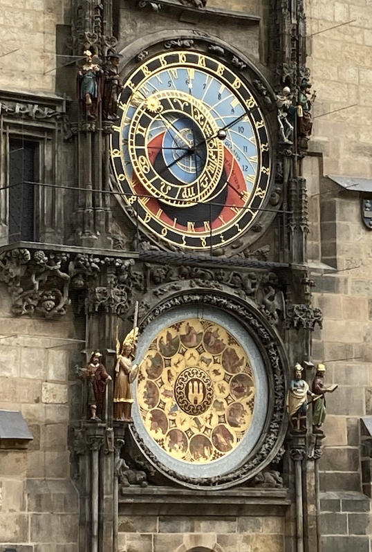
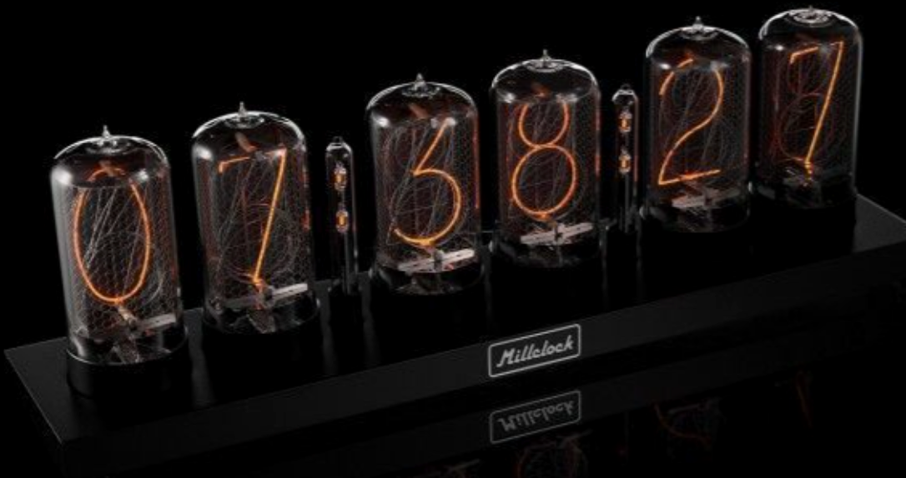

# The Architecture of Timekeeping Devices

Throughout history people have designed clocks that were not just functional, but were things of beauty to be admired.  The example above is the famous Astronomical Clock called [The Orloj](https://en.wikipedia.org/wiki/Prague_astronomical_clock) which was built in Prague around 1400.  It remains an important tourist attraction in the city.

Today, creating precise feature rich clocks is within the reach of anyone with $10 and a bit of curiosity.  Despite the fact that everyone uses their mobile phones to check the time, the landscape of creative and beautiful timekeeping devices continues to expand.  For example the market for beautiful Nixie tube clocks is perhaps larger than it has ever been due to the dedication of craftspeople like those people from [Millclock](https://millclock.com) in Ukraine.

I personally think that the Nixie Tube clocks, especially those created by Millclock are some of the 
most pleasing forms of handcrafted artwork I have seen.  The amount of engineering that goes
into manufacturing these 70 mm high retro-vacuum tubs is incredible.  Each wire in the tubes
are made and assembled by hand, which is why a price of almost $2,000 for each clock is not surprising.

It is interesting to note that many of the clocks in this course have features similar to
the Millclock clocks such as syncing with time servers to get accurate times.  So you don't need a huge budget to get a precise clock these days!

Regardless of your interest in timekeeping be it art, science, astronomy, being a maker, programming or AI, there are projects here to help you build your own highly personalized and customized timepiece using
low cost components starting around $10.  These devices can be a platform for fun, learning computational thinking and artistic expression.

One of the key things we learn about architecture choices is that there are few solutions that fit everyone's needs.  There are always trade offs.  You will find simple designs that are low-cost and easy to assemble in an hour.  You will also find complex designs that use exotic displays and integrate
light and motion sensors to create a personalized experience for your device.

First let take a look at the key architectural components of a timekeeping device.

## Core Components

Let's start with a high-level view of the core components of an electronic clock.  In the diagram above you see the following components:

1. **Sensors** - These are things buttons and knobs that help us configure the time and settings of a clock.
2. **Microcontroller** - This is the "brain" of our clock and where the programs run.  In our case we will be using the Raspberry Pi Pico and the Raspberry Pi Pico W (wireless) in our projects.
3. **Communications Bus** - this is how we communicated between the microcontroller and the display.  In our labs the bus we will use is either a I2C (slower) or the faster SPI bus.
4. **Display** - We will be using many types of displays from simple LEDs to complete graphical OLED displays.
5. **Power** - Most of our projects are powered by a 5 volt USB cable or batteries.

This diagram skims over a lot of the details like how we add wireless, photosensors to control brightness or adding speakers for sound for our alarm clocks.  But all our clocks will share these same basic components or very similar components.

The architecture for our clocks and watches is the same architecture used in a field of computing called [Physical Computing](https://en.wikipedia.org/wiki/Physical_computing) where computers read information from the real-world (incoming sensor data) and make changes to the world through actuators (usually things like motors and servos).  In the world of timekeeping, most of our output is the display and the speaker.  However, there are many fun clock projects that drive motors and servos to change the hands on a clock or change the visibility of a segment in a digit.

Now let's do a little deeper dive into each of these components.

## Details of our Components

### Sensors - Our Inputs

#### Buttons

Buttons are the most fundamental input devices in our clock projects. They serve multiple purposes including setting the time, changing modes, and configuring alarms. While they may seem simple, buttons require careful programming consideration to handle issues like switch bounce -- the tendency for mechanical switches to generate multiple signals when pressed once.

In our projects, we typically use momentary push buttons that are normally open, meaning they only complete the circuit when pressed. These buttons are connected to the Pico's GPIO pins configured with internal pull-up resistors. This configuration means the pin reads HIGH normally and LOW when the button is pressed, simplifying our circuit design by eliminating the need for external resistors.

Button debouncing is handled in our code using both hardware (capacitors) and software (timing delays) techniques. The code in our projects typically implements a debounce delay of 50-200 milliseconds, preventing multiple accidental triggers from a single press. This is particularly important when setting time values, where accuracy is crucial.

#### Rotary Encoder Knobs

Rotary encoders provide an intuitive way to adjust values like hours and minutes in our clock projects. Unlike potentiometers that have fixed start and end positions, rotary encoders can rotate continuously in either direction. They work by generating two square wave signals (often called A and B) that are offset by 90 degrees, allowing us to determine both the direction and speed of rotation.

The key advantage of rotary encoders in clock projects is their natural mapping to time adjustment -- clockwise rotation increases values while counterclockwise decreases them. Many of our projects use encoders with built-in push buttons, combining rotational input with selection capability in a single component. This allows users to both select what to adjust (by pressing) and make the adjustment (by rotating) with one control.

Programming rotary encoders requires careful attention to interrupt handling, as we need to monitor both signal pins simultaneously to determine direction. Our code typically uses hardware interrupts to detect changes on either pin, then compares the states to determine rotation direction. We also implement acceleration, where faster rotation results in larger value changes, making it efficient to make both small adjustments and large changes.

#### Photosensors

Photosensors add environmental awareness to our clock projects, enabling automatic brightness adjustment based on ambient light conditions. The most common type we use is the Light Dependent Resistor (LDR), whose resistance varies inversely with light intensity. This simple component allows our displays to be clearly visible in bright daylight while avoiding harsh glare in darkness.

Implementation of photosensors requires understanding analog-to-digital conversion, as these sensors output varying voltage levels rather than digital on/off signals. The Raspberry Pi Pico's ADC capabilities make it straightforward to read these analog values and convert them to usable brightness levels. Our projects typically map the sensor's full range to appropriate brightness values for our specific display type.

Many of our advanced projects combine photosensor data with time-based algorithms to create sophisticated brightness control. For example, we might implement hysteresis to prevent rapid brightness changes in fluctuating light conditions, or combine time-of-day information with light levels to optimize display visibility while conserving power.

### The MicroController

The microcontroller serves as the brain of our clock projects, executing the MicroPython code that manages timekeeping, input handling, and display updates. While simple clocks could be built with basic logic circuits, using a microcontroller gives us tremendous flexibility in features and functionality while actually reducing the component count.

Our projects primarily use the RP2040 microcontroller, which offers an excellent balance of processing power, memory, and input/output capabilities. Its dual-core architecture allows us to handle time-critical tasks like display updates on one core while managing user input and other features on the second core. The built-in programmable I/O (PIO) state machines are particularly useful for driving complex displays and handling precise timing requirements.

One of the key advantages of using a microcontroller is the ability to easily add new features through software updates. Want to add a new alarm type or change how the display animates? Simply modify the code and upload it. This flexibility extends to handling different types of time synchronization, from manual setting to NTP time servers when using the wireless-enabled Pico W.

#### The Raspberry Pi Pico and the RP2040

The Raspberry Pi Pico, built around the RP2040 chip, has become a go-to platform for DIY clock projects due to its robust feature set and low cost. The board provides 26 GPIO pins, hardware support for common interfaces like I2C and SPI, and built-in temperature sensing -- all features we leverage in our various clock designs.

What makes the Pico particularly suitable for clock projects is its reliable performance and excellent power management capabilities. The board can run in several power modes, from full-speed operation to low-power sleep modes that help extend battery life in portable projects. The built-in USB programming interface makes development straightforward, while the extensive MicroPython support provides access to a rich ecosystem of libraries and examples.

For more advanced projects, the Pico W variant adds wireless connectivity, enabling features like automatic time synchronization, weather display, and even remote configuration through web interfaces. The board's 2MB of flash storage provides ample space for our MicroPython code and additional features like custom fonts or sound files for alarms.

#### Real-Time Clocks (RTC)

Real-Time Clocks are specialized timekeeping devices that maintain accurate time even when the main power is removed. While the Raspberry Pi Pico includes an internal RTC, it resets when power is lost. External RTC modules like the DS3231 provide continuous timekeeping through battery backup, making them essential for reliable clock projects.

The DS3231 is particularly popular in our projects due to its high accuracy and temperature compensation. It communicates with the Pico using the I2C protocol, making it easy to integrate. The module includes a CR2032 battery backup that can maintain accurate time for several years without main power. Beyond basic timekeeping, it provides additional features like programmable alarms and a temperature sensor that helps compensate for timing variations caused by temperature changes.

Working with external RTCs requires understanding both hardware connections and software protocols. Our projects typically use MicroPython's machine.RTC class for the internal RTC, but switch to specific libraries for external RTC modules. This allows us to leverage advanced features like temperature readings and sophisticated alarm settings. The combination of an external RTC with the Pico's internal RTC can provide both accuracy and flexibility, with the external RTC serving as the authoritative time source while the internal RTC handles temporary timing needs.

#### Other Microcontrollers that Run MicroPython

While our course focuses on the Raspberry Pi Pico, many other microcontrollers support MicroPython and can be used for clock projects. Popular alternatives include the ESP32 family, which offers built-in WiFi and Bluetooth capabilities, and various STM32 boards known for their processing power and extensive peripheral options.

Each platform offers unique advantages. The ESP32, for instance, excels in wireless applications and includes a real-time clock (RTC) with battery backup capabilities. STM32 boards often provide more sophisticated analog interfaces and higher processing speeds, useful for complex display effects or audio generation.

The key advantage of using MicroPython across these platforms is code portability. Many of our basic clock functions can be transferred between different microcontrollers with minimal modification, allowing students to experiment with different hardware while building on their existing knowledge.

### Our Display

#### LEDx

LED displays form the foundation of many clock projects, ranging from simple seven-segment displays to complex LED matrices. The most basic projects use individual LEDs for time indication, while more advanced designs employ multiplexed seven-segment displays that can show hours, minutes, and even seconds with minimal microcontroller pins.

Seven-segment displays remain popular due to their excellent visibility and straightforward programming interface. Each digit consists of seven LEDs arranged in a figure-8 pattern, plus an optional decimal point. By controlling which segments are lit, we can display numbers 0-9 and some letters. Multiple digits are typically multiplexed -- rapidly switching between digits faster than the human eye can detect -- to create the illusion of simultaneous display while using fewer GPIO pins.

For more advanced projects, we often use LED matrices that provide greater flexibility in displaying both numbers and custom graphics. These can be controlled through shift registers or specialized LED driver ICs, reducing the number of required microcontroller pins while enabling complex animations and transitions.

#### Graphic Displays (OLED)

OLED displays represent a significant step up in capabilities, offering full graphic control with excellent contrast and wide viewing angles. These displays communicate with the microcontroller via I2C or SPI protocols and can show both text and graphics. The most common resolution in our projects is 128x64 pixels, providing ample space for creative clock faces.

The key advantage of OLED displays is their versatility. They can simulate traditional analog clock faces, display digital time in various fonts and sizes, and show additional information like temperature, humidity, or weather data. The high contrast ratio of OLED technology ensures excellent readability in various lighting conditions, while their low power consumption in displays with dark backgrounds makes them ideal for battery-powered projects.

Programming OLED displays requires understanding basic graphics concepts like framebuffers and drawing primitives. Our projects use libraries that abstract these details while still allowing direct pixel control when needed. We can create smooth animations, implement multiple clock face designs, and even build interactive menus for settings and configuration.

#### Speakers

In clock projects, speakers primarily serve for alarms and hourly chimes, though some advanced projects include more complex audio features. The simplest implementation uses a piezoelectric buzzer directly connected to a GPIO pin, capable of producing basic tones through PWM (Pulse Width Modulation) signals.

For better sound quality, some projects employ small magnetic speakers with audio amplifier circuits. These can reproduce more complex sounds and music, though they require more sophisticated driving circuits and careful power management. The Raspberry Pi Pico's PWM capabilities make it possible to generate various frequencies and even simple melodies without additional hardware.

Advanced projects might include multiple sound effects, customizable alarm tones, or even voice announcements. These typically require additional components like audio DACs (Digital-to-Analog Converters) or dedicated audio modules, along with careful consideration of timing to ensure smooth playback while maintaining accurate timekeeping.

#### Analog to Digital Converters

Analog to Digital Converters (ADCs) play a crucial role in our clock projects, primarily for reading sensors and implementing volume control for audio features. The Raspberry Pi Pico includes three ADC channels, providing 12-bit resolution for accurate measurements of analog signals.

In clock applications, ADCs are most commonly used with photoresistors for automatic brightness control and potentiometers for user adjustments. The conversion process involves sampling the analog voltage at regular intervals and converting it to digital values our code can process. The Pico's ADC can sample at up to 500,000 samples per second, far exceeding our typical needs for clock projects.

Understanding ADC principles is essential for handling real-world inputs effectively. Our projects implement techniques like oversampling to improve accuracy and filtering to reduce noise in measurements. This knowledge becomes particularly valuable when working with analog sensors for environmental monitoring or audio input processing.