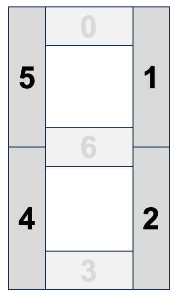

# Drawing Clock Digits

## The Seven Segments of a Numeric Digit

Since the early history of computing, numeric displays were created using a grouping
of seven individual lights to display a single digit.  These are called
[Seven Segment Displays](https://en.wikipedia.org/wiki/Seven-segment_display).  An
example is shown in the image below:

{ width="200" }

The segments are labeled "a" through "g" starting at the top and
going around in a clockwise direction.  Note that the seventh segment is in
the center element is the "g" segment.

Technically, many displays have an 8th segment for the decimal point (DP).  To keep
things simple we will just focus on the main seven segments in this lesson.

Clocks also usually have a colon that separates the hours and minutes
and an AM/PM indicator for 12-hour displays.  We will be treating
these and independent drawing components in this lab.  Many digital
clocks have the colon flash on and off every second.

## The Segment Map

To start out, we need to create a "digit-to-segment map" data structure.
We use this to help us figure out what segments to turn on
for any given digit.

We will also need to convert the segment letters into integers.  These integers will form the index of an array.

{ width="400" }

To write our code, we ask, for any given digit, is the segment on or off?

To do this, we can create an array of segments like this:

```py
segmentMapping = [
  #a, b, c, d, e, f, g
  [1, 1, 1, 1, 1, 1, 0], # 0
  [0, 1, 1, 0, 0, 0, 0], # 1
  [1, 1, 0, 1, 1, 0, 1], # 2
  [1, 1, 1, 1, 0, 0, 1], # 3
  [0, 1, 1, 0, 0, 1, 1], # 4
  [1, 0, 1, 1, 0, 1, 1], # 5
  [1, 0, 1, 1, 1, 1, 1], # 6
  [1, 1, 1, 0, 0, 0, 0], # 7
  [1, 1, 1, 1, 1, 1, 1], # 8
  [1, 1, 1, 1, 0, 1, 1]  # 9
];
```

For any given digit like "2" we can then just pass the index of "2"
to a Python list to get a list of the segments to turn on.  That line
of code looks like this:

```py
segmentOn = segmentMapping[digit];
```

This will return the segments that are to be turned on for any given
input digit.  For example:

```py
segmentOn = segmentMapping[2];
print(segmentOn)
# returns:
[1, 1, 0, 1, 1, 0, 1]
```

We now have the data structure to do the drawing.  We
will do this in two steps.

1. Draw the three horizontal lines for a digit if they are on
2. Draw all vertical lines for a given digit, keeping in mind
that we need to only draw half the way down the digit for
the upper left and upper right vertical segments (1 and 5)

We will start out with a simple digit drawing using a
single-pixel width line.  Later we will add a parameter
to change the thickness of the line.  But we want to take
this one-step-at-a-time.

## Drawing Horizontal Segments


This sample code will step through the horizontal lines
for segments 0, 3 and 6.  It will check using the ```segmentOn[i]```
line which will ONLY be true if that segment should be turned
on for a given digit.

Next, we figure out how high to draw the horizontal line.
To do this we will need to figure out the vertical offset (yOffset).
The top line (segment 0) has no offset and the bottom line
has the full height of the digit.

Unlike the vertical lines, the horizontal lines will span
the entire width of the area. That makes our code
simple because the line will have a horizontal length of exactly the 
x plus the width of the digit.

```py
# reasonable test values for a small display
x = 10
y = 10
width = 20
height = 30
# Horizontal segments
  for i in [0, 3, 6]:
    # check if this digit has the segment on
    if (segmentOn[i]):
      if (i==0): # top
          yOffset = 0 
      if (i==3):
          yOffset = height # bottom element
      if (i==6):
          yOffset = height // 2 # bottom
      # draw a signal thin line
      oled.line(x, y+yOffset, x + width, y+yOffset, 1)
```
## Drawing the Vertical Segments



Next, we need to create some code to draw the four vertical
segments.  This is a little more complex because the lines
do NOT span the full height of the digit.

```py
# Draw Vertical segments
x = 10
y = 10
width = 20
height = 30
# Draw the vertical segments ur, lr, ll, ul
for i in [1, 2, 4, 5]:
    if (segmentOn[i]) :
        # top two segments
        if (i==1 or i==5):
            startY = 0
            endY = height // 2
        if (i==2 or i==4):
            startY = height // 2
            endY = height
        # left segments
        if (i==4 or i==5): xOffset = 0
        # right segments
        if (i==1 or i==2): xOffset = width
        oled.line(x+xOffset, y+startY, x+xOffset, y+endY, 1)
```

## Testing Our Drawing

We can now wrap the code above in a ```drawDigit()``` function, and we will
test each of the digits 0-9 in a small test program.

Our first version of drawDigit is modeled after the rect() function.
After we pass in the digit, it takes in the (x,y) and width and height
parameters and the color value.

Draw Digit Function Parameters:

1. The digit to display - an integer in the range 0-9
2. x of the upper left corner
3. y of the upper left corner
4. the width of the digit (about 20 is a good value)
5. the height of the digit
6. the color (0=black, 1=white)

Here is our testing program that draws digits 0-9 in the center
of a standard 128x64 monochrome OLED display:

```py
# Lab 20: Draw Digits with just the line function
# this lab uses the line() function to draw the segments
import machine
import utime
import ssd1306
from utime import sleep, localtime
led = machine.Pin(25, machine.Pin.OUT)

SCL=machine.Pin(2) # SPI CLock
SDA=machine.Pin(3) # SPI Data
spi=machine.SPI(0, sck=SCL, mosi=SDA, baudrate=100000)

RES = machine.Pin(4)
DC = machine.Pin(5)
CS = machine.Pin(6)
WIDTH = 128
HEIGHT = 64

oled = ssd1306.SSD1306_SPI(WIDTH, HEIGHT, spi, DC, RES, CS)

segmentMapping = [
  #a, b, c, d, e, f, g
  [1, 1, 1, 1, 1, 1, 0], # 0
  [0, 1, 1, 0, 0, 0, 0], # 1
  [1, 1, 0, 1, 1, 0, 1], # 2
  [1, 1, 1, 1, 0, 0, 1], # 3
  [0, 1, 1, 0, 0, 1, 1], # 4
  [1, 0, 1, 1, 0, 1, 1], # 5
  [1, 0, 1, 1, 1, 1, 1], # 6
  [1, 1, 1, 0, 0, 0, 0], # 7
  [1, 1, 1, 1, 1, 1, 1], # 8
  [1, 1, 1, 1, 0, 1, 1]  # 9
];

 
# x and y are the center of the digit, size is the center to edge
def drawDigit(digit, x, y, width, height, color):
  # get a list of the segments that are on for this digit
  segmentOn = segmentMapping[digit];
  
  # Draw the horizontal segments: top, bottem, middle
  for i in [0, 3, 6]:
    if (segmentOn[i]):
      if (i==0): # top
          yOffset = 0 
      if (i==3):
          yOffset = height # bottom element
      if (i==6):
          yOffset = height // 2 # middle line
      oled.line(x, y+yOffset, x + width, y+yOffset, 1)

  # Draw the vertical segments ur, lr, ll, ul
  for i in [1, 2, 4, 5]:
    if (segmentOn[i]) :
        # top two segments
        if (i==1 or i==5):
            startY = 0
            endY = height // 2
        if (i==2 or i==4):
            startY = height // 2
            endY = height
        # left segments
        if (i==4 or i==5): xOffset = 0
        # right segments
        if (i==1 or i==2): xOffset = width
        oled.line(x+xOffset, y+startY, x+xOffset, y+endY, 1)


oled.fill(0)
oled.text('Lab 12: rect', 0, 0, 1)
x = 10 # upper left corner x
y = 10 # upper left corner y
w = 20 # digit width
h = 30 # digit height

while True:
    for i in range(0, 10):

        print(i)
        # create an outline one px away from the drawing region
        oled.rect(x-2, y-2, w+5, h+5, 1)
        # draw one digit
        drawDigit(i, x, y, w, h, 1)
        # draw a second digit
        #drawDigit(i, x + w + 4, w, h, t, 1)
        oled.text(str(i), 0, 54, 1)
        oled.show()
        sleep(2)
        oled.fill(0)
```

This ```drawDigit()``` is very handy.  We just need to
give the function some parameters and it will draw
the right digit at a location (x,y) as the upper
left corner with the correct width and height!

But the lines are somewhat thin.  A more robust implementation
will also allow us the change the thickness of the segments.
That will be more complex since we will have to adjust
the starting point of where we draw each segment based
on the thickness of the segment.  We
will also need to use a rectangle, not a line.  This
requires we figure out the exact width and height
before we draw.

We explore that function in the next lesson.