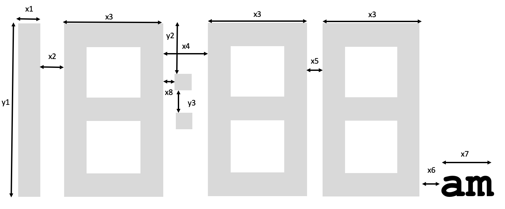

# Draw a Digital Clock Time Function

In this section, we will create a new function called ```drawTime```.  The input will be the upper left starting point (x,w), width and height, hours and minutes
and the format (12-hour or 24-hour) and the color (black or white).

This lab will build in the prior lab that displayed a single digit.

Let's first of all create a plan of how we will layout our digital clock display.

Our goal is to create a function that will be reusable over many types of displays with little or no modification.  This will require us to think through the potential ways our users will use this function and anticipate their needs so they
are not tempted to rewrite our code on their own.

## 12-Hour Display Format

Here is an example of our 12-hour clock layout:



Note that there are six horizontal x-dimension numbers and three vertical y-dimension numbers that you can adjust to create a pleasant interface.

## Automatically Scaling the Layout

It would be tempting to just hard-code the layout using a single set of numbers.
But what if the user wanted a smaller or larger portion of their display used to
display the time?

As the user selects the height and width of their clock we would like to scale these numbers accordingly.  The absolute values of these numbers is not too important
now.  We just want to get the relative values down.  To start the process, I did
a layout on an 11-inch wide drawing and I assigned the width of each digit to be 3.0.

```py
# horizontal
x1 = .73
x2 = .73
x3 = 3.0
x4 = 1.35
x5 = .5
x6 = .35
x7 = 1.5
x8 = .35
x9 = .5
# Vertical
y1 = 5.31
y2 = 1.58
y3 = .68
y4 = .68
```

We need to make the width of the display be x1 + x2 + 3*x3 + x4 + x5 + x6 + x7 which is


