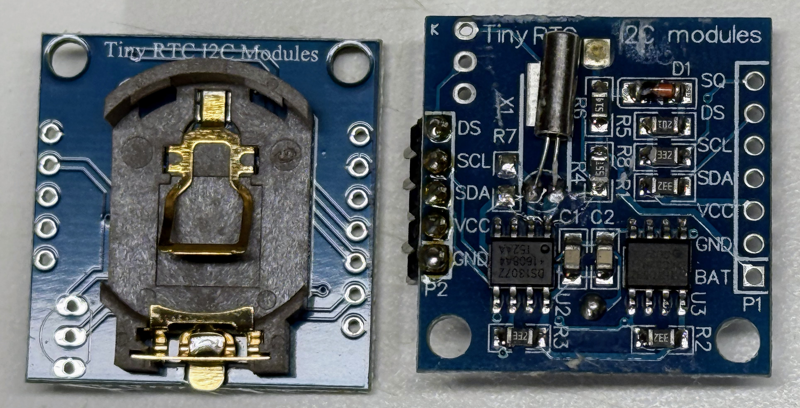
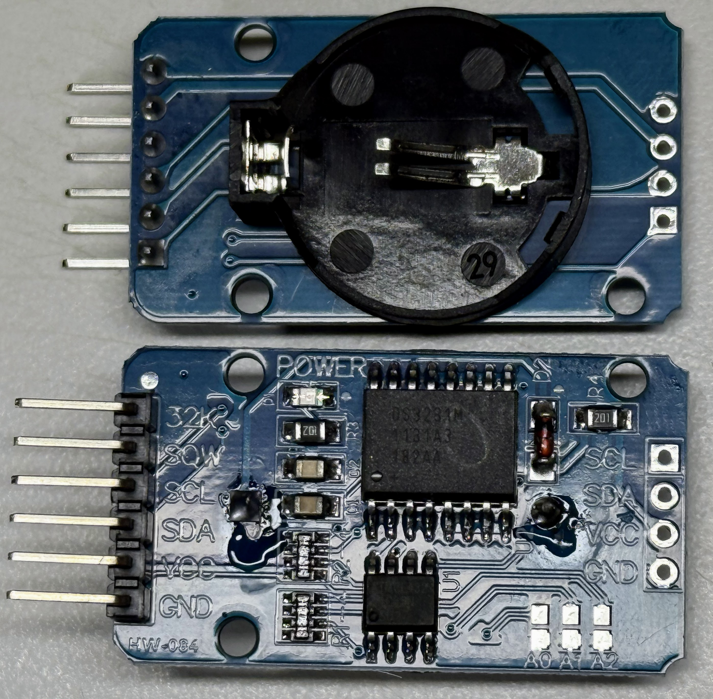

# Real Time Clocks

!!! note
    Real-time clock support has only recently been added to the core MicroPython libraries.
    Make sure you are using the latest release of MicroPython to use the features
    built into the MicroPython Runtime.

    See [The MicroPython RTC Documentation](https://docs.micropython.org/en/latest/library/machine.RTC.html) to make sure you have the right release.

## The DS1307 and the DS3231

Our lessons use two different RTC chips.  Let's do a comparison of these RTC modules and explain their implementation with the MicroPython.

### DS1307


This is the original battery-backed real-time clock with I2C interface that maintains basic timekeeping functions introduced by Maxim (then Dallas Semiconductor) around 2004-2005.
For example, the DS1307 can be used for tracking hours, minutes, seconds with ±2 seconds/day accuracy at C 77°F (25°).
This is appropriate for room temperature household clocks that have a uniform temperature.  Large
swings in temperature change crystal vibration frequency which can impact clock accuracy.

### DS3231



This is a newer temperature-compensated real-time clock Released by Maxim Integrated around 2009-2010.
With integrated crystal and I2C interface that maintains highly accurate timekeeping under varying conditions.

The DS3231 represented a significant advancement in accuracy and temperature compensation over the earlier DS1307. The improved technology helped make the DS3231 the preferred choice for precision timekeeping applications, despite its higher cost. The DS3231m typically maintains an accuracy of ±2 seconds each **month** (not day) across an incredible range of  -40°F to 185°F (-40°C to +85°C).
The DS3231 also has an on-board register you can access to get the current temperature
of the device.

Key Technical and Financial Differences:

1. Accuracy:
- DS1307: ±2 seconds/day
- DS3231: ±2 seconds/month due to temperature compensation

2. Temperature Operation:
- DS1307: 32°F to 158°F (0°C to +70°C)
- DS3231: -40°F to 185°F (-40°C to +85°C) with compensation

3. Clock Output:
- DS1307: Programmable square wave (1Hz, 4kHz, 8kHz, 32kHz)
- DS3231: 32kHz output plus programmable square wave

4. Based on typical retail prices as of 2024:
- DS1307: $1-2 USD
- DS3231: $3-5 USD

## Implementation with MicroPython

The coding for each of these chips in almost identical since they implement the same I2C interface.

```python
from machine import I2C, Pin

# Both modules use same I2C interface setup
i2c = I2C(0, sda=Pin(0), scl=Pin(1))

# DS1307 implementation
DS1307_ADDR = 0x68
def ds1307_get_time():
    return i2c.readfrom_mem(DS1307_ADDR, 0x00, 7)

# DS3231 implementation
DS3231_ADDR = 0x68
def ds3231_get_time():
    return i2c.readfrom_mem(DS3231_ADDR, 0x00, 7)
    
# Both modules store time in BCD format
def decode_bcd(bcd):
    return (bcd & 0xF) + ((bcd >> 4) * 10)
```

The code structure remains similar for both modules since they share the I2C interface and address. The DS3231 provides additional registers for temperature data and aging offset, which can be accessed for more precise timekeeping.

For classroom use, the DS3231 is recommended due to its superior accuracy and temperature compensation, though it typically costs more than the DS1307.

## Detecting the RTC Type

Both the DS1307 and the DS3231 appear at exactly the same address `0x68`.  So
how can you tell which device you have?  The answer is that the DS3231
has additional status, control and temperature registers we can look
for.  If it has these values we know it is the good stuff!

```python
from machine import I2C, Pin
import time

# I2C setup
i2c = I2C(0, sda=Pin(0), scl=Pin(1))

# Device addresses
RTC_ADDR = 0x68  # Both DS1307 and DS3231 use 0x68

def identify_rtc():
    """
    Identify whether the RTC is a DS1307 or DS3231
    Returns: String identifying the RTC type
    """
    try:
        # Try to read the status register (0x0F) - only exists on DS3231
        i2c.writeto(RTC_ADDR, b'\x0F')
        status = i2c.readfrom(RTC_ADDR, 1)[0]
        
        # Try to read control register (0x0E) - only exists on DS3231
        i2c.writeto(RTC_ADDR, b'\x0E')
        control = i2c.readfrom(RTC_ADDR, 1)[0]
        
        # If we got here, it's almost certainly a DS3231
        # Try reading temperature registers as final confirmation
        i2c.writeto(RTC_ADDR, b'\x11')
        temp_data = i2c.readfrom(RTC_ADDR, 2)
        
        return "DS3231 (Temperature-compensated RTC)"
        
    except Exception as e:
        # If we couldn't read those registers, it's probably a DS1307
        # Let's verify by trying to read the control register (0x07) of DS1307
        try:
            i2c.writeto(RTC_ADDR, b'\x07')
            control = i2c.readfrom(RTC_ADDR, 1)[0]
            return "DS1307 (Basic RTC)"
        except:
            return "Unknown RTC device"

def main():
    print("\nRTC Model Identifier")
    print("-" * 40)
    
    # First check if any device is present at RTC address
    devices = i2c.scan()
    if RTC_ADDR not in devices:
        print(f"No RTC found at address 0x{RTC_ADDR:02X}")
        return
        
    # Identify the RTC
    rtc_type = identify_rtc()
    print(f"Found: {rtc_type}")
    
    if "DS3231" in rtc_type:
        # Read temperature for DS3231
        i2c.writeto(RTC_ADDR, b'\x11')
        temp_data = i2c.readfrom(RTC_ADDR, 2)
        temp_msb = temp_data[0]
        temp_lsb = (temp_data[1] >> 6) * 25  # 0.25°C precision
        temp_c = temp_msb + (temp_lsb / 100.0)
        temp_f = (temp_c * 9/5) + 32
        print(f"Temperature: {temp_c:.2f}°C ({temp_f:.2f}°F)")

if __name__ == "__main__":
    main()
```

## RTCs and EEPROM

Some RTCs also include a small 4K EEPROM to store information such
as what time zone you are in and what the clock skew was for
the last period.  If your i2c scanner shows something
at digital 80 (0x50) when you add your RTC, this is your EEPROM.

The device at 80 (0x50) is almost certainly an AT24C32 EEPROM (Electrically Erasable Programmable Read-Only Memory). It's commonly included on DS3231 RTC modules to provide non-volatile storage. This EEPROM can store about 4KB of data and is often used to store configuration settings.

You can get a dump of its contents by doing the following detection code:

```python
from machine import I2C, Pin
import time

# I2C setup
i2c = I2C(0, sda=Pin(0), scl=Pin(1))

# Device addresses
DS3231_ADDR = 0x68  # 104 decimal
EEPROM_ADDR = 0x50  # 80 decimal

def read_ds3231_temp():
    """Read temperature from DS3231"""
    try:
        # First ensure we're reading fresh temperature data
        # Write to the control register (0x0E) to force a temperature conversion
        i2c.writeto(DS3231_ADDR, b'\x0E\x20')  # Set CONV bit
        time.sleep(0.2)  # Wait for conversion
        
        # Now read temperature registers (0x11 and 0x12)
        i2c.writeto(DS3231_ADDR, b'\x11')
        temp_data = i2c.readfrom(DS3231_ADDR, 2)
        
        # MSB is the integer part
        temp_msb = temp_data[0]
        
        # LSB holds two bits for decimal part
        temp_lsb = (temp_data[1] >> 6) * 25  # Convert to decimal (0.25°C precision)
        
        # Handle negative temperatures (2's complement)
        if temp_msb & 0x80:
            temp_msb = -(~(temp_msb - 1) & 0xFF)
            
        temp_c = temp_msb + (temp_lsb / 100.0)  # Combine integer and decimal parts
        temp_f = (temp_c * 9/5) + 32
        
        return temp_c, temp_f
    except Exception as e:
        return f"Error reading temperature: {str(e)}"

def read_ds3231_time():
    """Read current time from DS3231"""
    try:
        # Start reading from register 0x00
        i2c.writeto(DS3231_ADDR, b'\x00')
        data = i2c.readfrom(DS3231_ADDR, 7)
        
        # Convert BCD to decimal
        def bcd2dec(bcd):
            return (bcd & 0x0F) + ((bcd >> 4) * 10)
        
        second = bcd2dec(data[0])
        minute = bcd2dec(data[1])
        hour = bcd2dec(data[2])
        day = bcd2dec(data[4])
        month = bcd2dec(data[5] & 0x1F)
        year = bcd2dec(data[6]) + 2000
        
        return f"{year:04d}-{month:02d}-{day:02d} {hour:02d}:{minute:02d}:{second:02d}"
    except Exception as e:
        return f"Error reading time: {str(e)}"

def read_eeprom(start_addr=0, length=32):
    """Read data from EEPROM"""
    try:
        # Create buffer for address
        addr_buf = bytearray(2)
        addr_buf[0] = (start_addr >> 8) & 0xFF  # High byte
        addr_buf[1] = start_addr & 0xFF         # Low byte
        
        # Write address to EEPROM
        i2c.writeto(EEPROM_ADDR, addr_buf)
        
        # Read data
        data = i2c.readfrom(EEPROM_ADDR, length)
        return data
    except Exception as e:
        return f"Error reading EEPROM: {str(e)}"

def main():
    """Main program to read and display device information"""
    print("\nI2C Device Information Reader")
    print("-" * 40)
    
    # Scan for devices
    devices = i2c.scan()
    print(f"Found devices at addresses: {[hex(x) for x in devices]}")
    print("-" * 40)
    
    # Read and display DS3231 information
    # Note that the DS1307 does not have any temperature registers
    if DS3231_ADDR in devices:
        print("DS3231 RTC Information:")
        print(f"Current Time: {read_ds3231_time()}")
        temp_c, temp_f = read_ds3231_temp()
        print(f"Temperature: {temp_c:.2f}°C ({temp_f:.2f}°F)")
    else:
        print("DS3231 not found!")
    
    print("-" * 40)
    
    # Read and display EEPROM contents
    if EEPROM_ADDR in devices:
        print("AT24C32 EEPROM Contents (first 32 bytes):")
        eeprom_data = read_eeprom(0, 32)
        
        # Display as hex
        print("Hex dump:")
        for i in range(0, len(eeprom_data), 16):
            chunk = eeprom_data[i:i+16]
            hex_values = ' '.join([f'{x:02X}' for x in chunk])
            ascii_values = ''.join([chr(x) if 32 <= x <= 126 else '.' for x in chunk])
            print(f"{i:04X}: {hex_values:<48} {ascii_values}")
        
        # Try to interpret as ASCII
        print("\nASCII interpretation (if printable):")
        ascii_text = ''.join([chr(x) if 32 <= x <= 126 else '.' for x in eeprom_data])
        print(ascii_text)
    else:
        print("EEPROM not found!")

if __name__ == "__main__":
    main()
```

### Results of Scan on RTM with EEPROM

```
AT24C32 EEPROM Contents (first 32 bytes):
Hex dump:
0000: FF FF FF FF FF FF FF FF FF FF FF FF FF FF FF FF  ................
0010: FF FF FF FF FF FF FF FF FF FF FF FF FF FF FF FF  ................
ASCII interpretation (if printable):
................................
```

### Dump EEPROM Address

The AT24C32/AT24C64 EEPROM typically is located at 87 (0x57).

Here is a script to dump this memory.

```python
import time

# I2C setup
i2c = I2C(0, sda=Pin(0), scl=Pin(1))

# Device addresses
RTC_ADDR = 0x68  # Both DS1307 and DS3231 use 0x68
# EEPROM address
EEPROM_ADDR = 0x57

def dump_eeprom():
   # Read first 100 bytes in chunks of 8
   for addr in range(0, 100, 8):
       data = i2c.readfrom_mem(EEPROM_ADDR, addr, 8)
       print(f"0x{addr:02x}:", " ".join([f"{x:02x}" for x in data]))
       time.sleep(0.1)  # Small delay between reads

dump_eeprom()
```

## Setting thr RTC from localtime

After you get your RTC clock working it is time to set the
correct time in the RTC.  You will notice that when
the RTC first comes up the date and time will be set to January 1st
2015 at midnight.  We now want to update this time
with the time from your local laptop or desktop.  If you use Thonny, the
localtime in the Pico is automatically set to the time on
computer when Thonny starts up and connects to the Raspberry Pi Pico.

Now we just need a small program to take the localtime and write it
to the RTC's clock.  Here is tha line:

```python
i2c.writeto_mem(DS3231_ADDR, 0x00, data)
```

Where data is a binary coded list of binary-coded integers
that represent the datetime structure.  Here is
an example program called ```set-rtc-from-localtime.py```

```python
from machine import Pin, I2C
from utime import localtime

# I2C setup
sda = Pin(0, Pin.OUT)
scl = Pin(1, Pin.OUT)
i2c = I2C(0, scl=scl, sda=sda, freq=3000000)
DS3231_ADDR = 0x68

def dec2bcd(dec):
    """Convert decimal to binary coded decimal."""
    return (dec // 10) << 4 | (dec % 10)

def set_ds3231():
    now = localtime() # get the time Thonny set on connect
    year = now[0] % 100  # Convert to 2-digit year
    month = now[1]
    day = now[2]
    hour = now[3]
    minute = now[4]
    second = now[5]
    
    # convert from integers to BCD format and put into a bytearray
    data = bytearray([
        dec2bcd(second),
        dec2bcd(minute),
        dec2bcd(hour),
        dec2bcd(now[6] + 1),  # Convert weekday from 0-6 to 1-7
        dec2bcd(day),
        dec2bcd(month),
        dec2bcd(year)
    ])
    
    i2c.writeto_mem(DS3231_ADDR, 0x00, data)
    print(f"RTC set to: {month}/{day}/{now[0]} {hour:02d}:{minute:02d}:{second:02d}")

if __name__ == "__main__":
    set_ds3231()
```

## BCD Format

```python
def dec2bcd(dec):
    """Convert decimal to binary coded decimal."""
    return (dec // 10) << 4 | (dec % 10)
```

This converts regular numbers to Binary Coded Decimal format that the DS3231 requires. For example, 23 becomes 0x23.

BCD (Binary-Coded Decimal) is used in the DS3231 RTC for three main reasons:

1. **Readability** - Each digit maps directly to its binary value (e.g., 23 becomes 0x23), making it easier to read register values when debugging.
2. **Easy conversion** - Converting between BCD and human-readable time formats requires minimal processing, important for simple microcontrollers
3. **Historical compatibility** - Many early digital clock chips used BCD, and the format persisted in RTC design for consistency

In BCD, each decimal digit (0-9) is stored in 4 bits, with two digits per byte. For example:

Decimal 23 → BCD 0010 0011
Decimal 59 → BCD 0101 1001

## Avoid the Builtin Machine.RTC Library

The machine.RTC() on the Pico uses an internal oscillator that loses time on power loss, unlike the DS3231 which maintains time with its battery backup. The DS3231 is also more accurate (±2ppm vs ±10% for the internal RTC).

Unless you need absolute minimal components, stick with the DS3231 for better accuracy and battery backup capability.

The internal RTC example on the [MicroPython RP2](https://docs.micropython.org/en/latest/rp2/quickref.html#real-time-clock-rtc) site would work functionally, but would need resetting after each power cycle.

