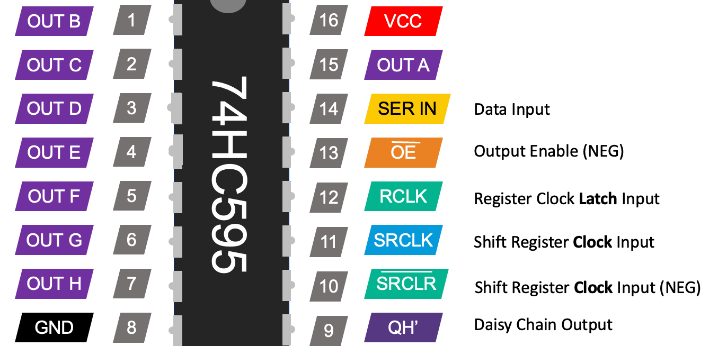

# Shift Registers

## Sample Prompt
!!! Prompt
    Please create a detailed tutorial about using shift registers that would be understood
    by a 9th grade high school student.  Assume that the student already
    knows about using the Raspberry Pi Pico to turn on and off LEDs,but does not have enough
    output pins to drive all 4 digits on a seven-segment display clock.
    Suggest where figures should be added and what the figures should
    contain.  Discuss the 74HC595 chip, what its inputs and outputs are and what some basic MicroPython code would look like to turn on and off some
    LEDs controlled by the 74HC595.  Return the tutorial in markdown format.

## Sample Response

## Using Shift Registers to Control More LEDs with Your Pico

Have you ever wanted to build a digital clock but ran out of pins on your Raspberry Pi Pico? A shift register can help! Think of a shift register like a magical helper that turns a few Pico pins into many output pins. Let's learn how to use one!



## What is a Shift Register?

A shift register is like a row of eight boxes that can each hold either a 1 (on) or 0 (off). The cool part is that you can control all eight outputs using just three pins from your Pico! The 74HC595 is a popular and easy-to-use shift register.

## The Important Pins on the 74HC595

- **Data Pin (DS or SER IN)**: This is where you send your 1s and 0s, one at a time
- **Clock Pin (SRCLK)**: Each time this pin gets a pulse, it shifts all the data one position
- **Latch Pin (STCP or RCLK)**: When pulsed, this updates all outputs at once
- **Output Pins (Q0-Q7)**: These eight pins connect to your LEDs
- **Power (VCC)**: Connect to 3.3V
- **Ground (GND)**: Connect to ground

### Detailed Pin Descriptions

#### SRCLK

**Shift Register Clock** or **Input Clock**  - A digital input signal that controls the shifting of data through a serial-to-parallel register by generating a transition from low to high voltage level. 

**Example:** Pulsing SRCLK from 0V to 3.3V causes each bit to move one position in the shift register.

#### RCLK

**Register Clock** or **Latch Pin** A digital input signal that transfers the contents of the shift register to the storage register by generating a transition from low to high voltage level. 

**Example:** Pulsing RCLK from 0V to 3.3V updates all output pins simultaneously with new values.  The term "latch pin" is more descriptive of its function (it "latches" or locks in the data), while *RCLK* is the technical abbreviation used in datasheets. On the 74HC595 chip, this is pin 12, and it's also sometimes labeled as *STCP* (STorage Clock Pulse).

## Wiring It Up

[Figure 3: Show a wiring diagram with:

- A Pico
- A 74HC595
- Several LEDs with their resistors
- The connections between them]

Here's how to connect everything:

1. Connect VCC to 3.3V on the Pico
2. Connect GND to ground
3. Connect Data DS to GPIO 16
4. Connect Clock (SRCLK) to GPIO 17
5. Connect Latch (RCLK) to GPIO 18
6. Connect LEDs with resistors to outputs Q0-Q7

## The Code

Here's some simple MicroPython code to control your LEDs:

```python
from machine import Pin
from utime import sleep

# Set up our Pico pins
data_pin = Pin(16, Pin.OUT)
clock_pin = Pin(17, Pin.OUT)
latch_pin = Pin(18, Pin.OUT)

def shift_byte(byte_val):
    # Send each bit one at a time
    for i in range(8):
        # Get the current bit (0 or 1)
        bit = (byte_val >> (7-i)) & 1
        
        # Set the data pin
        data_pin.value(bit)
        
        # Pulse the clock
        clock_pin.value(1)
        clock_pin.value(0)
    
    # Pulse the latch to show the new pattern
    latch_pin.value(1)
    latch_pin.value(0)

# Example: Light up alternate LEDs
while True:
    shift_byte(0b10101010)  # Turn on LEDs 7,5,3,1
    sleep(1)
    shift_byte(0b01010101)  # Turn on LEDs 6,4,2,0
    sleep(1)
```

## How It Works

[Figure 4: Show an animation or series of diagrams demonstrating how data shifts through the register]

1. The `shift_byte` function takes a number between 0 and 255
2. It converts this number into eight separate bits (1s and 0s)
3. For each bit:
   - It puts the bit on the data pin
   - Pulses the clock to shift it in
4. After all 8 bits are sent, it pulses the latch to update all LEDs at once

## Using Multiple Shift Registers

[Figure 5: Show how to chain two 74HC595s together]

Need even more outputs? You can chain shift registers together! Connect the Q7' (serial out) pin of the first shift register to the DS (data) pin of the second one. They'll share the same clock and latch pins.

## Practice Project: Binary Counter

Try this: Make a program that counts from 0 to 255, showing each number in binary on your LEDs. Here's a starter:

```python
for number in range(256):
    shift_byte(number)
    sleep(0.1)  # Wait a bit between numbers
```

This will help you understand how binary numbers work while practicing with your shift register!

## Common Problems and Solutions

1. **LEDs not lighting up?** 
   - Check your connections
   - Make sure your LEDs have resistors
   - Verify your ground connections

2. **Random LED patterns?**
   - Make sure your clock and latch pulses are complete
   - Check if your data is sending in the right order

## Next Steps

Once you're comfortable with this, you can:
1. Control a 4-digit display for your clock
2. Make LED light patterns
3. Build a binary game
4. Create a VU meter for music

Remember: A shift register is just a tool to help you control more things with fewer pins. With practice, you'll find lots of cool ways to use it in your projects!

[Note: All figures should be clear, well-labeled, and include captions explaining what they show. Consider using color coding for different types of connections (power, data, ground) in the diagrams.]
## Example: 74HC595

## References

* [Shift Registers on Wikipedia](https://en.wikipedia.org/wiki/Shift_register)
* [Nice Animation of Shift Registers by Last Minute Engineering](https://lastminuteengineers.com/74hc595-shift-register-arduino-tutorial/)