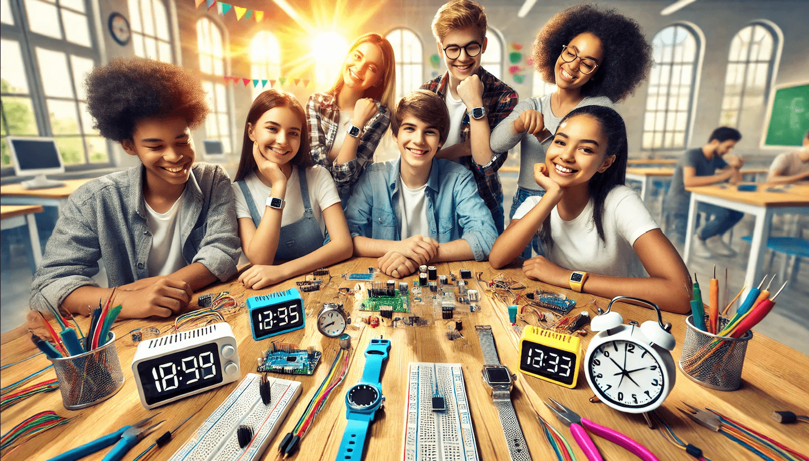

# Generate a Banner Image

!!! prompt
    Please generate a banner image for my new website called "Designing and Building Clocks and Watches with MicroPython and AI".  Make the banner features kids with diverse skin tone having fun working together and building clock and watch projects in a school.  Use bright colors but no text.  Use images of both digital and analog clocks and smartwatches.  Place breadboards, wire, microcontrollers digital watch displays and smartwatch displays on the table. 

## Sample Result
