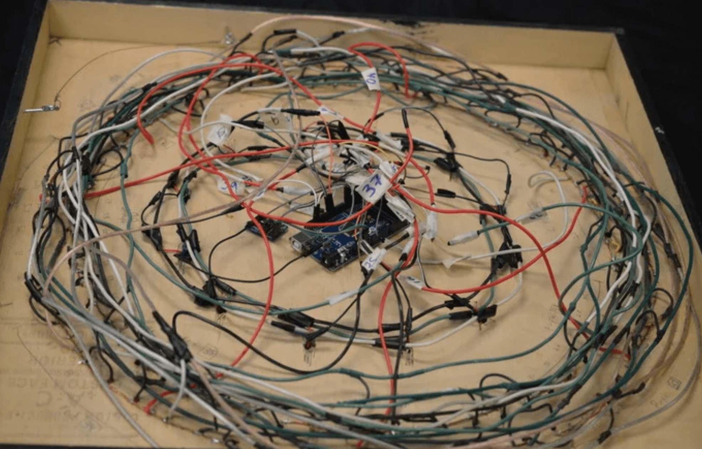
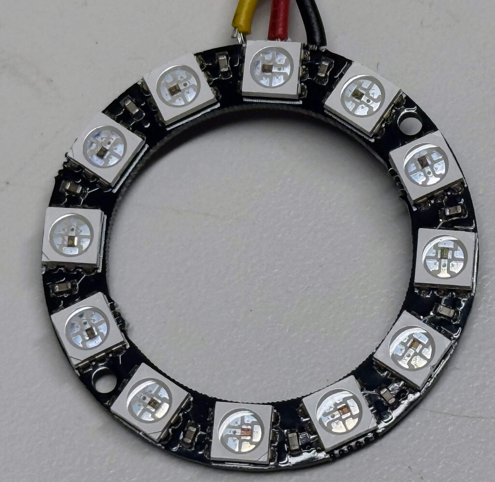
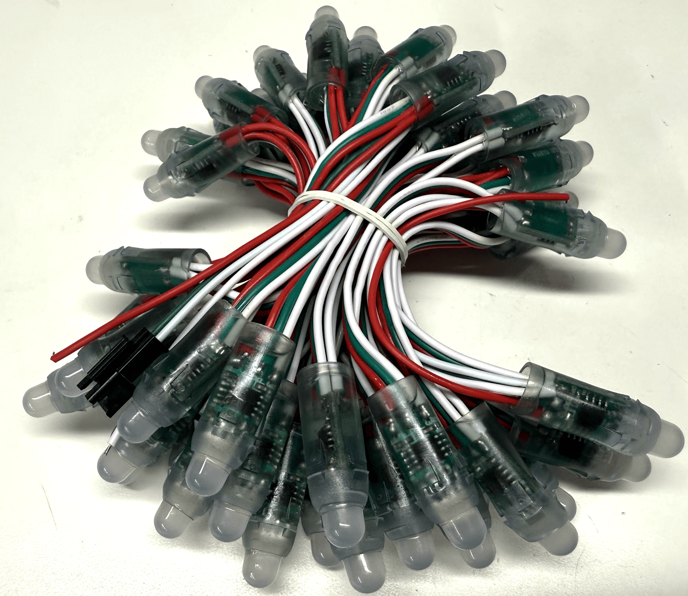

# LED Clocks

Our strategy for teaching is to provide a base
set of examples of working clocks and watches. We then also
provide a set of "Challenges" for students to go
further.  One challenge is can you use simple LEDs
to create your own clock?  This is where creativity
comes in.

Much of the creativity in this course relies on displaying time
information in creative ways using both simple LEDs as well
as using LED strips also known as NeoPixel strips.

There are tradeoffs for each of these approaches.  There is
no single answer and each student will have different
curiosity.

## Basic Custom LED Circuit Approach

Used LEDs requires more wiring and the need to understand how to use
current limiting resistors.  This approach promotes lower-level
understanding of concepts such as current, voltage drop, resistors, current measuring and soldering.
Students can place the LEDs in any arrangement on foam-core board, plexiglass or wood.

Remember that a digit requires seven segments with each segment requiring up to
3 LEDs.  For a four digit clock that means you will need around 70 LEDs.

## NeoPixel Approach

<figure markdown>
  { width="300" }
  <figcaption>This 12-element NeoPixel ring is perfect for a clock face.  Different colors
can be used to display the hours, minutes and seconds.</figcaption>
</figure>

[NeoPixels](../glossary.md#neopixel) are connivent since you can wire an entire clock display including the seven-segments for four digits, the flashing colon and the AM/PM indicator with a single LED strip or a string of
addressable LED lights.  The focus will be on programming these strips to
display the correct time.

You can get NeoPixels in strips (the most common) but also in strings that can be
easily moved into the pattern of an 7-segment display.

<figure markdown>
  { width="300" }
  <figcaption>The NeoPixel string allows you to easily place the pixels in the shape of a 7-segment digit.</figcaption>
</figure>

For more examples of using NeoPixels with MicroPython, please refer to the [Moving Rainbow](https://dmccreary.github.io/moving-rainbow/) website.  This site has detailed tutorials appropriate for begging Python students.

## References

* [Daniel Mouritzen NeoPixel Clock in MicroPython](https://gist.github.com/danmou/ced74b8df3719988a7c8294f9f6ffb25) - this uses a ESP32 but the code should be mostly the same.

* [LED Arduino Clock on Instructables by Trask River Productions](https://www.instructables.com/LED-Arduino-Clock/) This incredible clock uses 5 packages of 25 RGB LEDs.  Each LED requires four connections for a total of almost
500 connections that must to be manually soldered and tested.
