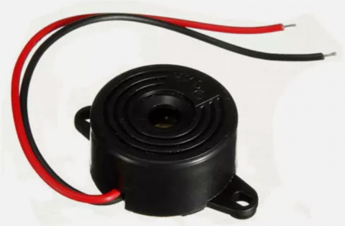
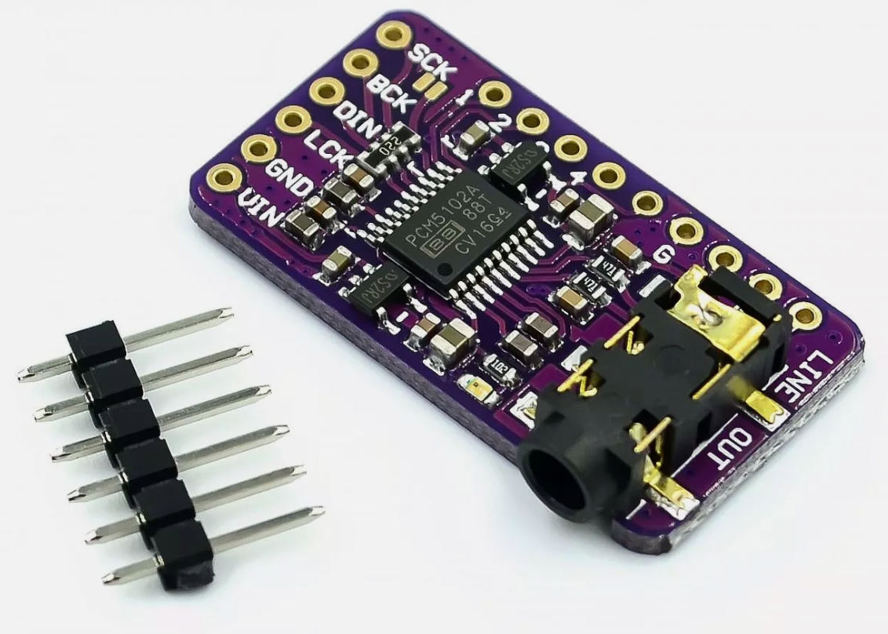
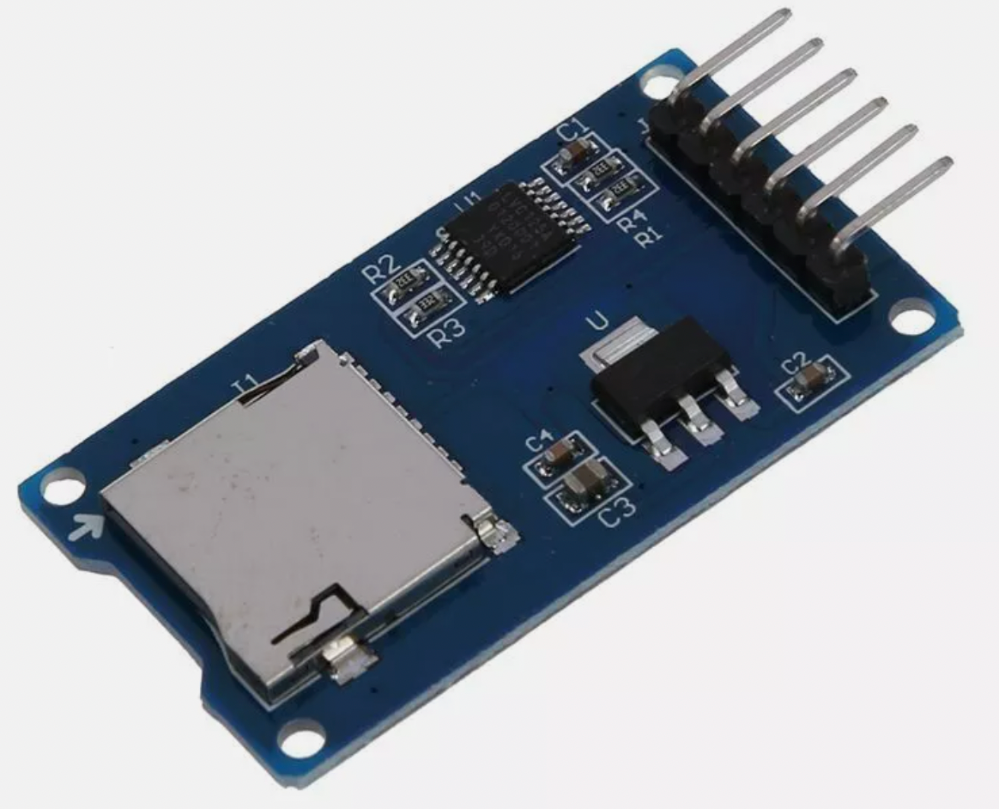
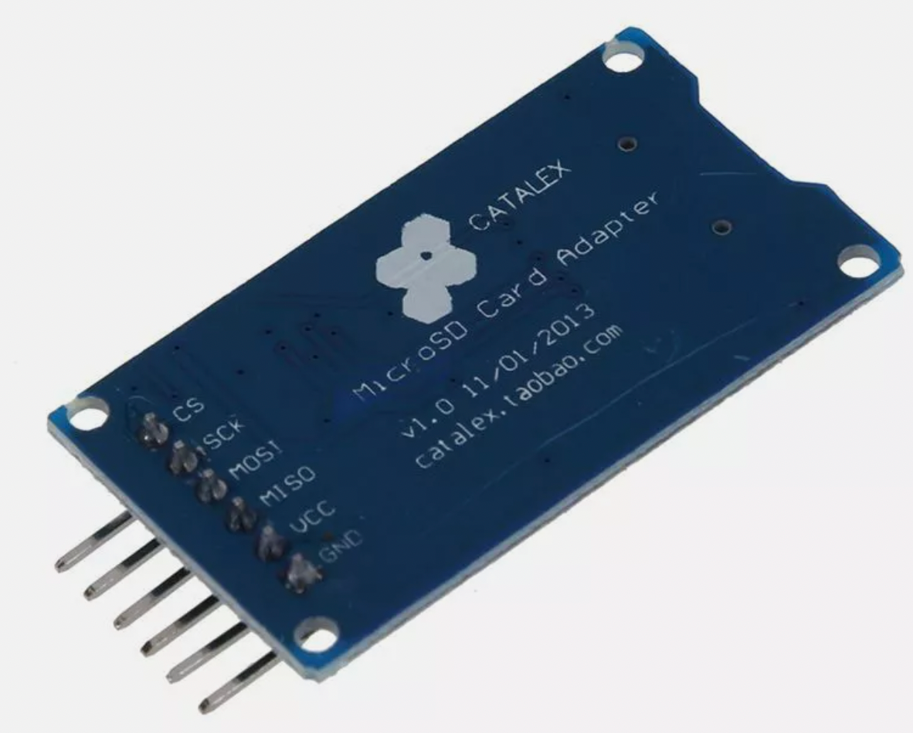

# Adding Sound to Your Clock

Many students want to add alarm features to their clock projects. The Raspberry Pi Pico can generate tones using Pulse Width Modulation (PWM) in MicroPython. Here are the key options for audio output devices:

## Piezo Ceramic Disc

A thin ceramic disc that converts electrical signals into sound through mechanical vibration.

**Pros:**
- Extremely low cost ($0.50-$2 each)
- Very simple to connect (just 2 wires)
- No additional components needed
- Durable and reliable
- Perfect for basic beeps and alarms
- Uses minimal power

**Cons:**
- Limited sound quality
- Can only produce simple tones
- Relatively quiet
- Not suitable for music playback
- Can be harsh-sounding at high volumes

**Typical Educational Lab Cost:** $10-15 for a pack of 10 discs

## Piezo Speakers

Small enclosed speakers with a built-in resonant chamber.

**Pros:**
- Low cost ($2-5 each)
- Better sound quality than bare ceramic discs
- Built-in enclosure improves volume
- Simple 2-wire connection
- Good for alarms and basic melodies
- More pleasant sound than bare discs

**Cons:**
- Still limited audio quality
- Not suitable for music playback
- Slightly more expensive than bare discs
- Fixed resonant frequency can affect tone quality

**Typical Educational Lab Cost:** $20-30 for a pack of 10 speakers

## Standard Speakers

Traditional cone speakers with magnets and voice coils.

**Pros:**
- Much better sound quality
- Can play actual music
- Wide frequency response
- Available in various sizes
- Good volume levels

**Cons:**
- More expensive ($4-15 each)
- Requires amplification circuit
- More complex wiring
- Higher power requirements
- Takes up more space
- More fragile than piezos

**Typical Educational Lab Cost:** $20-60 for a set of 5 small speakers

## Digital to Analog Converters (DAC)

Chips that convert digital signals to analog audio.

**Pros:**
- High-quality audio output
- Can play music and complex sounds
- Professional audio capabilities
- Clean signal output
- Multiple channels possible

**Cons:**
- Most expensive option ($2-5 per chip)
- Requires additional components
- Complex wiring and setup
- Needs amplification
- Requires more advanced programming
- May need level shifting circuits

**Typical Educational Lab Cost:** $20-50 for a complete setup with 5 DAC modules

## MicroSD Readers

Card readers for storing and playing audio files.

**Pros:**
- Can store many sound files
- Allows for custom sounds
- Easy to update sounds
- Works well with DACs
- Flexible storage options

**Cons:**
- Additional cost ($2-5 per reader)
- Requires SD card library
- More complex programming
- Needs file system management
- Additional power requirements
- Must handle card formatting

**Typical Educational Lab Cost:** $30-40 for a set of 5 readers plus cards

**Recommendation for School Labs:**
For a basic classroom set serving 20 students:

- 20 Piezo ceramic discs ($10)
- 10 Piezo speakers ($15)
- 5 small standard speakers ($30)
- 4 DAC modules ($20)
- 4 MicroSD readers ($20)

Total recommended budget: ~$120 for a well-rounded audio lab setup that allows students to experiment with different sound options while keeping the basic piezo components affordable for everyone.